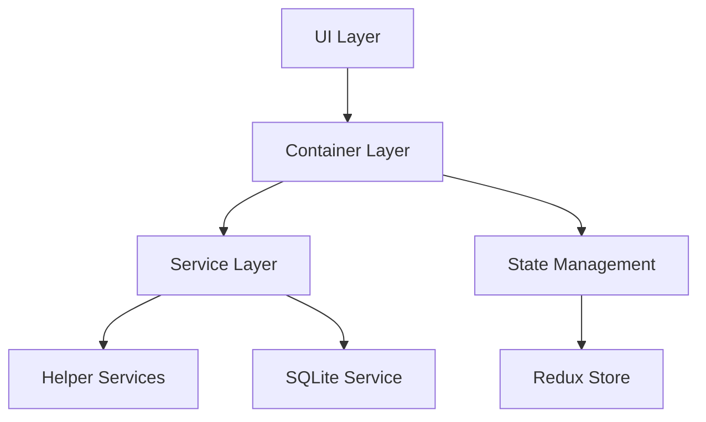
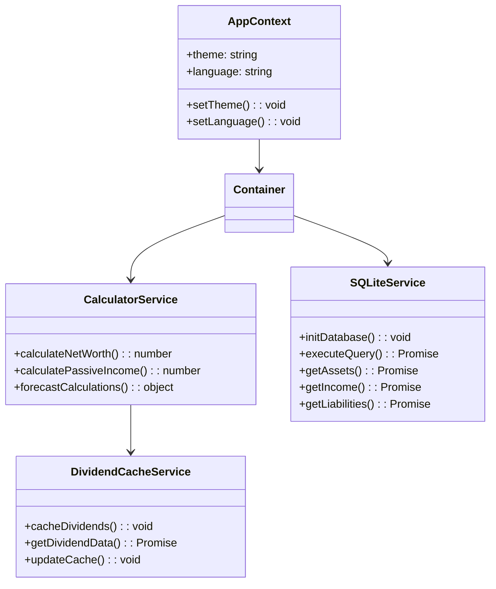

# Passive Income Calculator

_Last updated: June 2025_<br>
Language: TypeScript, React, Capacitor<br>

[](https://sonarcloud.io/summary/new_code?id=ChristianScheub_Typescript_PassivIncomeCalculator)
[](https://sonarcloud.io/summary/new_code?id=ChristianScheub_Typescript_PassivIncomeCalculator)
[](https://sonarcloud.io/summary/new_code?id=ChristianScheub_Typescript_PassivIncomeCalculator)
[](https://sonarcloud.io/summary/new_code?id=ChristianScheub_Typescript_PassivIncomeCalculator)
[](https://sonarcloud.io/summary/new_code?id=ChristianScheub_Typescript_PassivIncomeCalculator)
[](https://sonarcloud.io/summary/new_code?id=ChristianScheub_Typescript_PassivIncomeCalculator)
[](https://sonarcloud.io/summary/new_code?id=ChristianScheub_Typescript_PassivIncomeCalculator)

A comprehensive, cross-platform financial planning application for tracking passive income, assets, expenses, and more. Built with React, TypeScript, and Capacitor for iOS, Android, and Web.

---

## 🌟 Features
- 📊 Dashboard with real-time financial overview
- 💰 Income, expense, and asset management
- 📈 Dividend tracking and caching
- 💳 Liabilities and debt management
- 🔮 Financial forecast and milestone visualization
- 🌍 Multi-language support (i18next, JSON-based)
- 🎨 Light/Dark theme (TailwindCSS)
- 📱 Cross-platform: iOS, Android, Web
- 🔄 Offline capability with SQLite
- 🔐 Secure local data storage
- 🧩 Modular, maintainable architecture
- 🧪 Unit, integration, and E2E tests

---

## 🏗 Architecture

### Application Layers


### Class Architecture


---

## 🛠 Technology Stack

**Core:** React, TypeScript, Capacitor, Vite, TailwindCSS, Redux Toolkit

**Key Libraries:**
- @capacitor/core, @capacitor/ios, @capacitor/android, @capacitor/sqlite
- recharts (charts)
- i18next (internationalization)
- redux-toolkit (state management)
- react-router-dom (navigation)

---

## 📁 Project Structure

```
src/
├── App.tsx                    # Application entry point
├── container/                 # Container components with business logic
├── context/                   # React context definitions
├── hooks/                     # Custom React hooks
├── i18n/                      # Internationalization setup (JSON-based)
├── layouts/                   # Layout components
├── service/                   # Business logic and services
│   ├── calculatorService/     # Financial calculations
│   ├── dividendCacheService/  # Dividend caching
│   ├── exchangeService/       # Currency exchange
│   ├── formatService/         # Data formatting
│   ├── sqlLiteService/        # Database operations
│   ├── stockAPIService/       # Stock API integration
│   └── Logger/                # Application logging
├── store/                     # Redux store configuration
├── types/                     # TypeScript type definitions
├── ui/                        # Reusable UI components
└── view/                      # Page components
```

---

## 🚀 Getting Started

### Prerequisites
- Node.js (v18 or higher)
- npm or yarn
- Xcode (for iOS)
- Android Studio (for Android)

### Installation
```bash
# Clone the repository
git clone [repository-url]
# Install dependencies
npm install
# Setup environment
npm run setup
# Start development server
npm run dev
```

### Platform-specific Setup
#### iOS
```bash
npm run ios:setup
npm run ios:open
```
#### Android
```bash
npm run android:setup
npm run android:open
```

---

## 📜 Available Scripts
- `npm run dev` - Start development server
- `npm run build` - Build production version
- `npm run preview` - Preview production build
- `npm run lint` - Run ESLint
- `npm run test` - Run tests
- `npm run ios:sync` - Sync iOS project
- `npm run android:sync` - Sync Android project
- `npm run deploy:web` - Deploy web version
- `npm run deploy:ios` - Deploy iOS version
- `npm run deploy:android` - Deploy Android version

---

## 🔄 State Management
Redux Toolkit is used for state management with the following main slices:
- Assets
- Income
- Expenses
- Liabilities
- Settings
- UI State

---

## 🌐 Internationalization
- Multi-language support via i18next and JSON translation files
- English (default), German, and easily extendable

---

## 🎨 Theming
- Light and dark themes via TailwindCSS
- Custom configuration in `tailwind.config.js` and `src/hooks/useTheme.ts`

---

## 🔒 Security
- Secure local data storage with SQLite
- No sensitive data sent to external servers
- Offline-first approach
- Data backup and restore functionality

---

## 📱 Mobile Features
- Native performance via Capacitor
- Touch-optimized, responsive UI
- Platform-specific UI adjustments

---

## 📈 Performance Optimization
- Code splitting, lazy loading
- Memoization of expensive calculations
- Efficient SQLite queries
- Dividend data caching

---

## 🤝 Contributing
1. Fork the repository
2. Create your feature branch
3. Commit your changes
4. Push to the branch
5. Create a Pull Request

---

## 📞 Support
For support, please open an issue or contact the maintainers.

---

## 🙏 Acknowledgments
- React community
- Capacitor team
- TailwindCSS team
- All contributors

---

_Made with ❤️ for financial independence_
