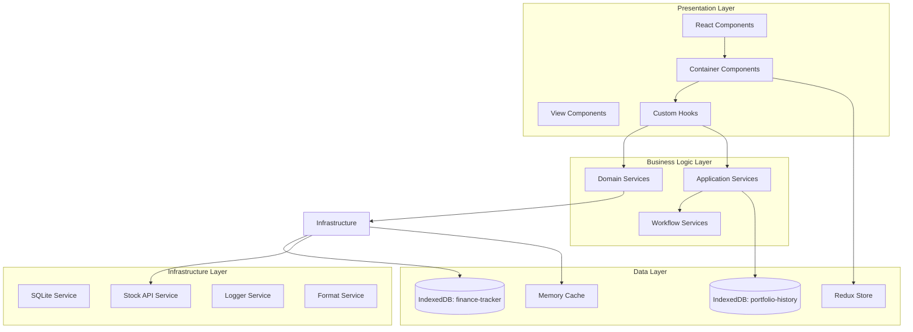
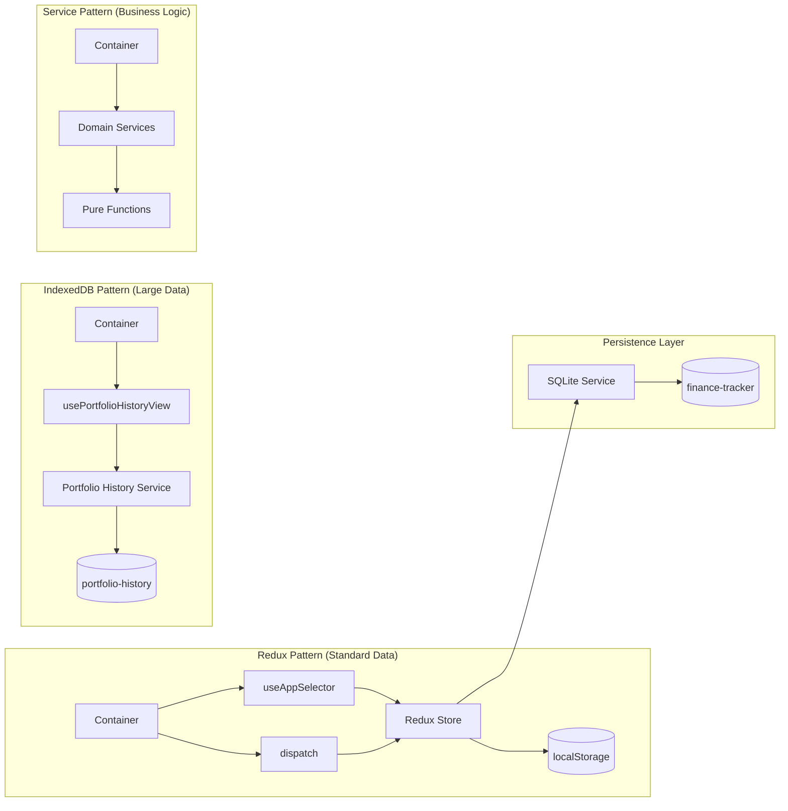
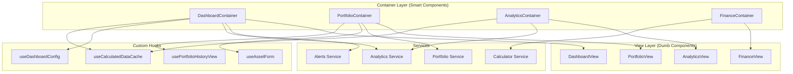

# Passive Income Calculator
_Last updated: June 2025_<br>
Language: TypeScript, React, Capacitor<br>

[](https://sonarcloud.io/summary/new_code?id=ChristianScheub_Typescript_PassivIncomeCalculator)
[](https://sonarcloud.io/summary/new_code?id=ChristianScheub_Typescript_PassivIncomeCalculator)
[](https://sonarcloud.io/summary/new_code?id=ChristianScheub_Typescript_PassivIncomeCalculator)
[](https://sonarcloud.io/summary/new_code?id=ChristianScheub_Typescript_PassivIncomeCalculator)
[](https://sonarcloud.io/summary/new_code?id=ChristianScheub_Typescript_PassivIncomeCalculator)
[](https://sonarcloud.io/summary/new_code?id=ChristianScheub_Typescript_PassivIncomeCalculator)
[](https://sonarcloud.io/summary/new_code?id=ChristianScheub_Typescript_PassivIncomeCalculator)

A comprehensive, cross-platform financial planning application for tracking passive income, assets, expenses, and portfolio analytics. Built with React, TypeScript, and Capacitor for iOS, Android, and Web, featuring advanced portfolio history tracking and real-time analytics.

---

## 🌟 Features

### � **Financial Management**
- 📊 Real-time financial dashboard with multiple view modes
- � Income, expense, and asset portfolio management
- 📈 Advanced dividend tracking with intelligent caching
- 💳 Comprehensive debt and liability management
- 🔮 Financial forecasting and milestone visualization
- 📉 Portfolio history with intraday and daily tracking

### 🎯 **Analytics & Insights**
- 📊 Interactive charts with historical performance
- 🎯 Financial ratio calculations and analytics
- � Goal tracking and milestone management
- 📈 Asset allocation and diversification analysis
- 💡 Intelligent alerts and recommendations

### 🛠 **Technical Features**
- �🌍 Multi-language support (i18next, JSON-based)
- 🎨 Adaptive light/dark theme system
- 📱 Cross-platform: iOS, Android, Web (PWA)
- 🔄 Offline-first with advanced data persistence
- 🔐 Secure local data storage (dual IndexedDB)
- ⚡ High-performance calculations with intelligent caching
- 🧩 Clean Architecture with Domain-Driven Design
- 🧪 Comprehensive testing (Unit, Integration, E2E)

---

## 🏗 Architecture

### High-Level Application Architecture


### Data Flow Architecture


### Detailed Container/View Pattern


---

## 🛠 Technology Stack

**Core Technologies:**
- **Frontend:** React 18, TypeScript 5.0, Vite 5.0
- **Mobile:** Capacitor 6.0 (iOS, Android, PWA)
- **Styling:** TailwindCSS 3.4, Lucide Icons
- **State Management:** Redux Toolkit 2.0

**Key Libraries:**
- **Database:** IndexedDB (idb library), Capacitor SQLite
- **Charts:** Recharts 2.8 (Financial charts and analytics)
- **Internationalization:** i18next, react-i18next (JSON-based translations)
- **Navigation:** React Router DOM 6.0
- **Forms:** Custom form system with validation
- **Date/Time:** date-fns (Lightweight date manipulation)

**Development & Build:**
- **Build Tool:** Vite with TypeScript support
- **Linting:** ESLint 8.0 with TypeScript rules
- **Testing:** Jest, React Testing Library, E2E with Cypress
- **Code Quality:** SonarCloud integration

**Mobile Platform Features:**
- **iOS:** Native app distribution via App Store
- **Android:** Native app distribution via Google Play
- **PWA:** Progressive Web App with offline capabilities

---

## 📁 Project Structure

```
src/
├── App.tsx                         # Application entry point and routing
├── main.tsx                        # Vite entry point and React DOM rendering
├── i18n.ts                         # Internationalization configuration
├── index.css                       # Global styles and TailwindCSS imports
│
├── container/                      # Smart components with business logic
│   ├── analytics/                  # Analytics and reporting containers
│   │   ├── AnalyticsHubContainer.tsx
│   │   ├── CustomAnalyticsContainer.tsx
│   │   └── DistributionsAnalyticsContainer.tsx
│   ├── assets/                     # Asset management containers
│   │   ├── AssetDefinitionsContainer.tsx
│   │   ├── AssetCalendarContainer.tsx
│   │   └── PortfolioHistoryContainer.tsx
│   ├── dashboard/                  # Dashboard containers
│   │   ├── DashboardContainer.tsx
│   │   └── AssetDashboardView.tsx  # Asset-focused dashboard
│   ├── finance/                    # Financial data containers
│   │   ├── ExpensesContainer.tsx
│   │   ├── IncomeContainer.tsx
│   │   └── LiabilitiesContainer.tsx
│   ├── portfolio/                  # Portfolio management containers
│   │   └── PortfolioHubContainer.tsx
│   └── settings/                   # Application settings containers
│       └── SettingsContainer.tsx
│
├── context/                        # React context definitions
│   └── AppContext.tsx              # Global app state context
│
├── hooks/                          # Custom React hooks
│   ├── redux.ts                    # Redux hooks (useAppSelector, useAppDispatch)
│   ├── useAppInitialization.ts     # App startup and initialization
│   ├── useAssetCalculationsWithCache.ts  # Asset calculation hooks
│   ├── useCalculatedDataCache.ts   # Calculated data cache management
│   ├── useDashboardConfig.ts       # Dashboard configuration hook
│   ├── usePortfolioHistoryView.ts  # Portfolio history data hooks
│   ├── useAssetForm.ts             # Asset form management
│   ├── useFormConfig.ts            # Form configuration and validation
│   ├── useSnackbar.ts              # Snackbar notifications
│   └── useTheme.ts                 # Theme management
│
├── layouts/                        # Layout components
│   ├── DesktopLayout.tsx           # Desktop-specific layout
│   └── MobileLayout.tsx            # Mobile-specific layout
│
├── locales/                        # Internationalization files
│   ├── en.json                     # English translations
│   └── de.json                     # German translations
│
├── service/                        # Business logic and services (Clean Architecture)
│   ├── domain/                     # Domain services (business logic)
│   │   ├── analytics/              # Analytics domain
│   │   │   ├── calculations/       # Financial analytics calculations
│   │   │   └── reporting/          # Business reporting services
│   │   ├── assets/                 # Asset management domain
│   │   │   ├── calculations/       # Asset value and income calculations
│   │   │   └── market-data/        # Stock API and market data
│   │   ├── financial/              # Financial operations domain
│   │   │   ├── calculations/       # Financial calculations
│   │   │   ├── income/             # Income calculations
│   │   │   ├── expenses/           # Expense calculations
│   │   │   ├── liabilities/        # Liability calculations
│   │   │   └── exchange/           # Currency exchange
│   │   └── portfolio/              # Portfolio management domain
│   │       ├── management/         # Portfolio CRUD operations
│   │       └── history/            # Portfolio historical tracking
│   ├── application/                # Application services (use cases)
│   │   ├── workflows/              # Complex business processes
│   │   ├── orchestration/          # Service coordination
│   │   ├── portfolioHistoryCalculation/  # Portfolio history workflows
│   │   └── notifications/          # Cross-domain notifications
│   ├── infrastructure/             # Infrastructure services (technical)
│   │   ├── sqlLiteService/         # Main database (finance-tracker)
│   │   ├── sqlLitePortfolioHistory/  # Portfolio history database
│   │   ├── cacheService/           # In-memory caching
│   │   ├── formatService/          # Data formatting utilities
│   │   └── configService/          # System configuration
│   └── shared/                     # Shared services (utilities)
│       ├── utilities/              # Common utility functions
│       ├── logging/                # Centralized logging service
│       └── calculations/           # Shared calculation utilities
│
├── store/                          # Redux store configuration
│   ├── index.ts                    # Store configuration and root reducer
│   ├── slices/                     # Redux Toolkit slices
│   │   ├── transactionsSlice.ts    # Asset transactions state
│   │   ├── assetDefinitionsSlice.ts # Asset definitions state
│   │   ├── assetCategoriesSlice.ts # Asset categories state
│   │   ├── incomeSlice.ts          # Income state management
│   │   ├── expensesSlice.ts        # Expenses state management
│   │   ├── liabilitiesSlice.ts     # Liabilities state management
│   │   ├── calculatedDataSlice.ts  # Calculated data cache
│   │   ├── portfolioIntradaySlice.ts # Intraday data cache
│   │   ├── dashboardSettingsSlice.ts # Dashboard configuration
│   │   └── snackbarSlice.ts        # UI notifications
│   ├── middleware/                 # Redux middleware
│   │   ├── dataChangeMiddleware.ts # Automatic data persistence
│   │   ├── portfolioCacheMiddleware.ts # Portfolio cache management
│   │   └── calculatedDataCacheMiddleware.ts # Calculated data caching
│   └── actions/                    # Redux actions (if needed)
│
├── types/                          # TypeScript type definitions
│   ├── domains/                    # Domain-specific types
│   │   ├── assets/                 # Asset-related types
│   │   ├── financial/              # Financial data types
│   │   ├── analytics/              # Analytics and reporting types
│   │   └── portfolio/              # Portfolio management types
│   ├── shared/                     # Shared types across domains
│   └── utils/                      # Utility types
│
├── ui/                             # Reusable UI components (design system)
│   ├── common/                     # Common UI components
│   │   ├── Card.tsx                # Card component
│   │   ├── Button.tsx              # Button variants
│   │   ├── Modal.tsx               # Modal dialogs
│   │   └── LoadingSpinner.tsx      # Loading states
│   ├── forms/                      # Form components
│   │   ├── Input.tsx               # Input fields
│   │   ├── Select.tsx              # Select dropdowns
│   │   └── FormValidation.tsx      # Form validation UI
│   ├── charts/                     # Chart components
│   │   ├── LineChart.tsx           # Line chart wrapper
│   │   ├── PieChart.tsx            # Pie chart wrapper
│   │   └── PortfolioChart.tsx      # Portfolio-specific charts
│   ├── dashboard/                  # Dashboard-specific UI
│   │   ├── QuickActionsCard.tsx    # Quick action buttons
│   │   ├── MiniAnalyticsCard.tsx   # Mini analytics display
│   │   └── NetWorthSnapshot.tsx    # Net worth display
│   └── navigation/                 # Navigation components
│       ├── TabNavigation.tsx       # Tab navigation
│       └── Breadcrumbs.tsx         # Breadcrumb navigation
│
├── utils/                          # Utility functions and helpers
│   ├── containerUtils.ts           # Container helper functions
│   ├── formUtils.ts                # Form utility functions
│   ├── validationSchemas.ts        # Form validation schemas
│   ├── portfolioCacheUtils.ts      # Portfolio cache utilities
│   ├── sortingUtils.ts             # Data sorting utilities
│   └── cn.ts                       # className utility (clsx/tailwind-merge)
│
├── view/                           # Dumb components (presentation layer)
│   ├── analytics-hub/              # Analytics views
│   ├── finance-hub/                # Financial management views
│   │   └── overview/               # Financial overview components
│   │       ├── DashboardView.tsx   # Main dashboard view
│   │       ├── AssetDashboardView.tsx # Asset-focused dashboard
│   │       └── PortfolioHistoryCard.tsx # Portfolio history display
│   ├── portfolio-hub/              # Portfolio management views
│   │   ├── assets/                 # Asset management views
│   │   ├── expenses/               # Expense management views
│   │   ├── income/                 # Income management views
│   │   └── liabilities/            # Liability management views
│   └── settings/                   # Settings views
│       └── SettingsView.tsx        # Application settings
│
├── theme/                          # Theme configuration
│   ├── ThemeProvider.tsx           # Theme context provider
│   └── muiTheme.ts                 # Material-UI theme (if used)
│
├── config/                         # Configuration files
│   └── featureFlags.ts             # Feature flag configuration
│
└── constants/                      # Application constants
    ├── formOptions.ts              # Form option constants
    └── index.ts                    # General constants
```

---

## 🚀 Getting Started

### Prerequisites
- Node.js (v18 or higher)
- npm or yarn
- Xcode (for iOS)
- Android Studio (for Android)

### Installation
```bash
# Clone the repository
git clone [repository-url]
# Install dependencies
npm install
# Setup environment
npm run setup
# Start development server
npm run dev
```

### Platform-specific Setup
#### iOS
```bash
npm run ios:setup
npm run ios:open
```
#### Android
```bash
npm run android:setup
npm run android:open
```

---

## 📜 Available Scripts

### Development
```bash
npm run dev                    # Start development server (Vite + React)
npm run build                  # Build production version
npm run preview                # Preview production build locally
npm run lint                   # Run ESLint with TypeScript rules
npm run lint:fix               # Fix ESLint issues automatically
```

### Mobile Development
```bash
# iOS Development
npm run ios:setup              # Initial iOS project setup
npm run ios:sync               # Sync web assets to iOS project
npm run ios:open               # Open iOS project in Xcode
npm run ios:build              # Build iOS app
npm run ios:run                # Run iOS app on simulator/device

# Android Development  
npm run android:setup          # Initial Android project setup
npm run android:sync           # Sync web assets to Android project
npm run android:open           # Open Android project in Android Studio
npm run android:build          # Build Android app
npm run android:run            # Run Android app on emulator/device
```

---

## 📞 Support & Documentation

### Getting Help
- **GitHub Issues**: Report bugs and request features
- **Discussions**: Ask questions and share ideas
- **Documentation**: Check the `/docs` folder for detailed guides
- **Service Documentation**: See `src/service/README.md` for architecture details

### Useful Resources
- **Architecture Guide**: `src/service/README.md` - Complete service layer documentation
- **Type Definitions**: `src/types/` - TypeScript interfaces and types
- **Component Library**: `src/ui/` - Reusable UI component documentation
- **Testing Guide**: `tests/README.md` - Testing standards and examples

---

## 🙏 Acknowledgments

### Core Technologies
- **React Team**: For the excellent React framework and ecosystem
- **Capacitor Team**: For enabling seamless cross-platform development
- **TypeScript Team**: For bringing type safety to JavaScript
- **TailwindCSS Team**: For the utility-first CSS framework
- **Redux Toolkit Team**: For simplifying Redux development

### Open Source Libraries
- **Recharts**: Beautiful and composable charts for React
- **i18next**: Comprehensive internationalization framework
- **date-fns**: Modern JavaScript date utility library
- **Lucide**: Beautiful and consistent icon library

### Development Tools
- **Vite**: Lightning-fast build tool and development server
- **ESLint & Prettier**: Code quality and formatting tools
- **Jest & Cypress**: Comprehensive testing frameworks
- **SonarCloud**: Code quality and security analysis

---

_Made with ❤️ for financial independence and data ownership_