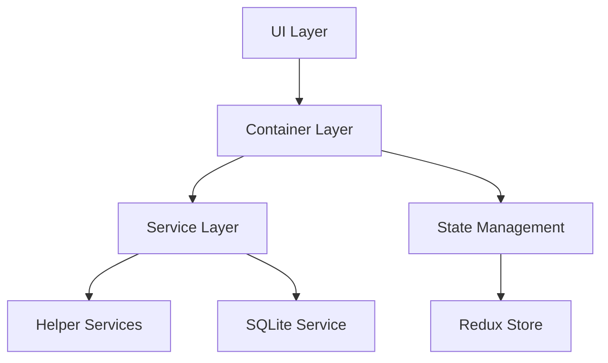
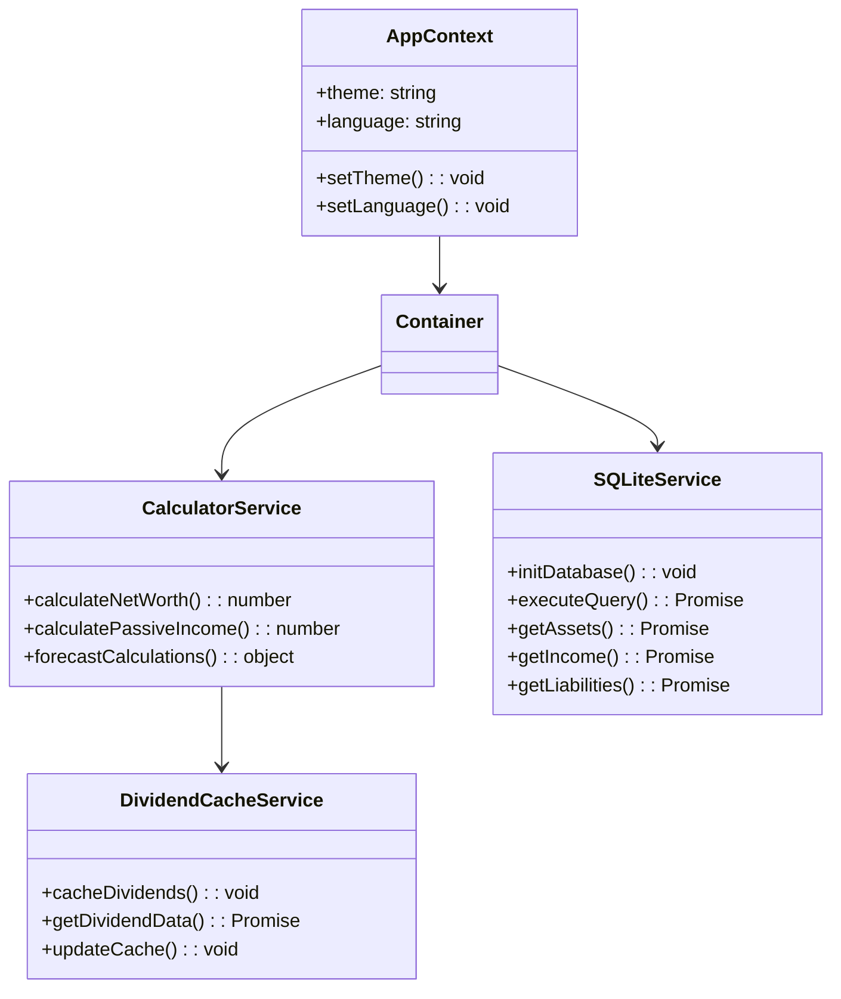

# Passive Income Calculator

A comprehensive financial planning application built with React, TypeScript, and Capacitor for cross-platform deployment (iOS, Android, and Web).

## 🌟 Features

- 📊 Dashboard with financial overview
- 💰 Income tracking and management
- 💳 Expense monitoring
- 📈 Asset portfolio management
- 📉 Liabilities tracking
- 🔮 Financial forecast visualization
- 🌍 Multi-language support
- 🎨 Light/Dark theme support
- 📱 Cross-platform (iOS, Android, Web)
- 🔄 Offline capability with SQLite
- 📈 Dividend tracking and caching

## 🏗 Architecture

### Application Layers



### Class Architecture



## 🛠 Technology Stack

### Core Technologies
- **React** - UI framework
- **TypeScript** - Programming language
- **Capacitor** - Cross-platform deployment
- **Vite** - Build tool and development server
- **TailwindCSS** - Styling
- **Redux Toolkit** - State management

### Key Libraries
- **@capacitor/core** - Native platform integration
- **@capacitor/ios** - iOS platform support
- **@capacitor/android** - Android platform support
- **@capacitor/sqlite** - Local database management
- **recharts** - Chart visualization
- **i18next** - Internationalization
- **tailwindcss** - Utility-first CSS
- **redux-toolkit** - State management
- **react-router-dom** - Navigation

## 📁 Project Structure

```
src/
├── App.tsx                    # Application entry point
├── container/                 # Container components with business logic
├── context/                   # React context definitions
├── hooks/                    # Custom React hooks
├── i18n/                     # Internationalization setup
├── layouts/                  # Layout components
├── service/                  # Business logic and services
│   ├── calculatorService/    # Financial calculations
│   ├── formatService/        # Data formatting
│   ├── sqlLiteService/      # Database operations
│   └── Logger/              # Application logging
├── store/                    # Redux store configuration
├── types/                    # TypeScript type definitions
├── ui/                      # Reusable UI components
└── views/                   # Page components
```

## 🚀 Getting Started

### Prerequisites
- Node.js (v18 or higher)
- npm or yarn
- Xcode (for iOS development)
- Android Studio (for Android development)

### Installation

```bash
# Clone the repository
git clone [repository-url]

# Install dependencies
npm install

# Setup environment
npm run setup

# Start development server
npm run dev
```

### Platform-specific Setup

#### iOS
```bash
# Install iOS dependencies
npm run ios:setup

# Open in Xcode
npm run ios:open
```

#### Android
```bash
# Install Android dependencies
npm run android:setup

# Open in Android Studio
npm run android:open
```

## 📜 Available Scripts

- `npm run dev` - Start development server
- `npm run build` - Build production version
- `npm run preview` - Preview production build
- `npm run lint` - Run ESLint
- `npm run test` - Run tests
- `npm run ios:sync` - Sync iOS project
- `npm run android:sync` - Sync Android project
- `npm run deploy:web` - Deploy web version
- `npm run deploy:ios` - Deploy iOS version
- `npm run deploy:android` - Deploy Android version

## 🔄 State Management

The application uses Redux Toolkit for state management with the following main slices:
- Assets
- Income
- Expenses
- Liabilities
- Settings
- UI State

## 🌐 Internationalization

Supports multiple languages through i18next:
- English (default)
- German
- More languages can be added in `src/i18n/locales`

## 🎨 Theming

Supports light and dark themes through TailwindCSS with custom configuration in:
- `tailwind.config.js`
- `src/hooks/useTheme.ts`

## 🔒 Security

- SQLite for secure local data storage
- No sensitive data transmitted to external servers
- Offline-first approach
- Data backup functionality

## 📱 Mobile Features

- Native performance through Capacitor
- Touch-optimized UI
- Responsive design
- Platform-specific UI adjustments

## 🧪 Testing

- Unit tests with Jest
- Component tests with React Testing Library
- E2E tests with Cypress

## 📈 Performance Optimization

- Code splitting
- Lazy loading of components
- Memoization of expensive calculations
- Efficient SQLite queries
- Dividend data caching

## 🤝 Contributing

1. Fork the repository
2. Create your feature branch
3. Commit your changes
4. Push to the branch
5. Create a Pull Request

## 📞 Support

For support, please open an issue in the repository or contact the maintainers.

## 🙏 Acknowledgments

- React community
- Capacitor team
- TailwindCSS team
- All contributors

---

Made with ❤️ for financial independence
