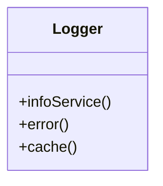
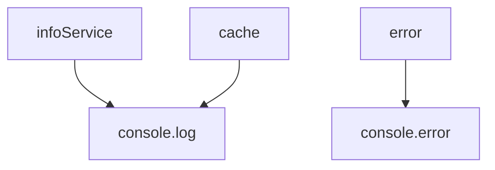
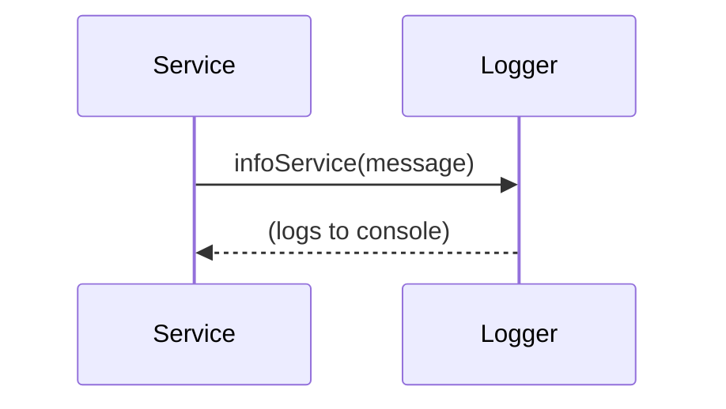

# Logger

The `Logger` service provides centralized logging functionality for the application. It supports different log levels (info, error, cache) and is used by all major services to record important events, errors, and cache operations.

## Purpose
- Centralizes all logging logic for the app.
- Supports multiple log levels and structured messages.
- Enables easier debugging and monitoring.

## Usage
Import and use the logger in any service, container, or component:

```typescript
import Logger from '../service/Logger/logger';
Logger.infoService('Calculation started');
Logger.error('An error occurred');
Logger.cache('Cache hit for asset');
```

## Structure
- Provides methods for info, error, and cache logs.
- Can be extended for additional log levels or integrations.
- Stateless and reusable.

## Example UML Class Diagram


## Example Method Dependency Diagram


## Example Sequence Diagram (Internal Flow)


---

The `Logger` service is essential for monitoring, debugging, and maintaining the health of the application.
