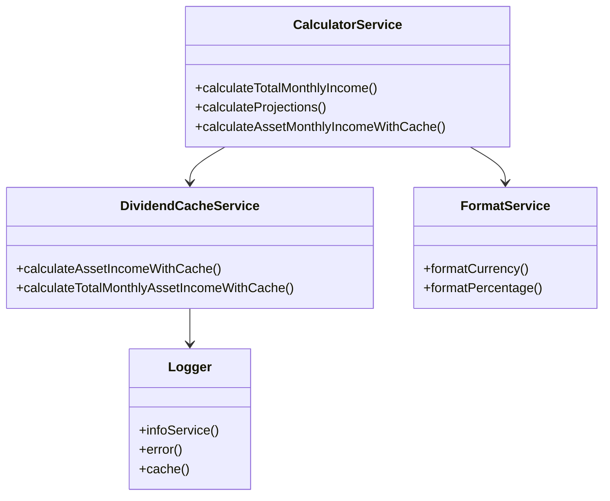
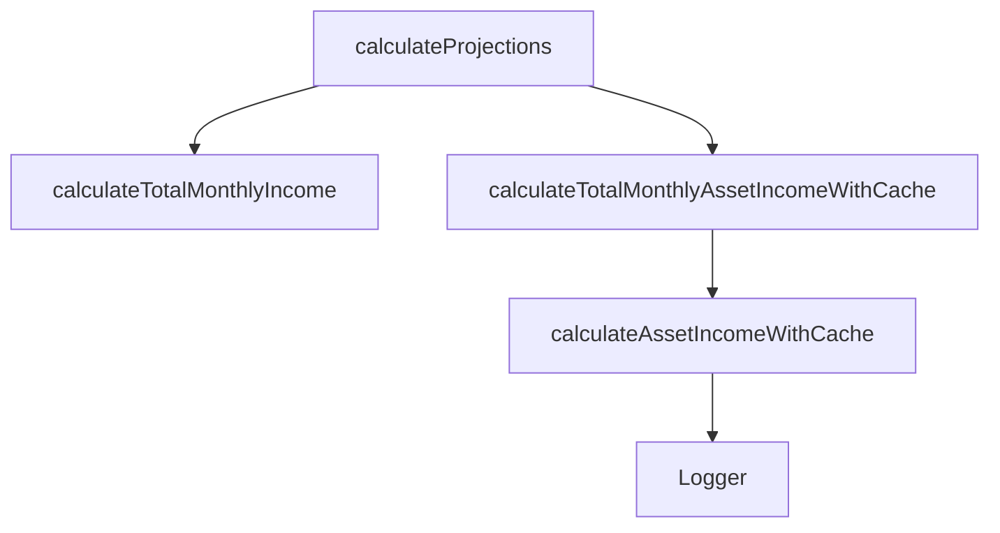
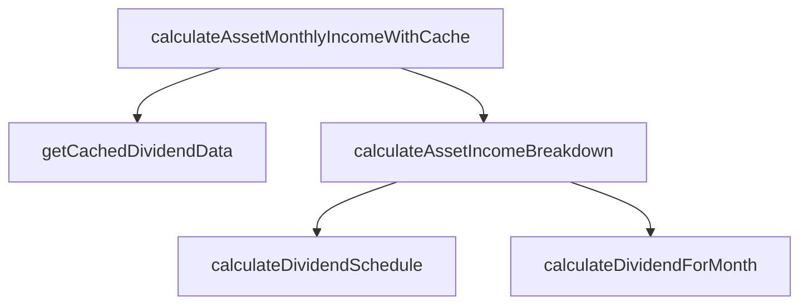
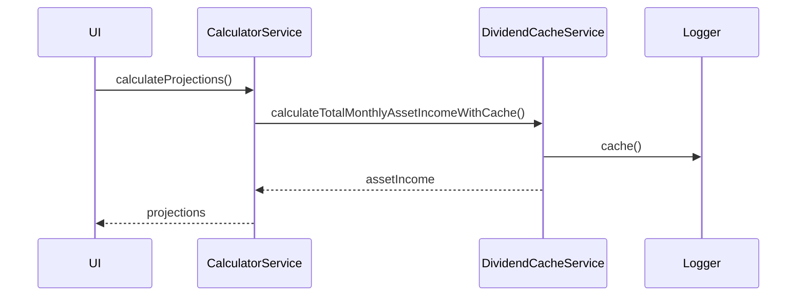

# Service Layer

Die Service-Schicht kapselt die Geschäftslogik und externe Integrationen der Anwendung. Sie stellt wiederverwendbare Funktionen und Klassen bereit, die von Containern, Views und anderen Komponenten genutzt werden.

## Aufbau
- Jeder Service ist in einem eigenen Unterordner oder als Datei organisiert.
- Services sind lose gekoppelt und können unabhängig getestet und erweitert werden.
- Typische Aufgaben: Datenberechnung, API-Kommunikation, Formatierung, Logging, Datenbankzugriffe.

## Nutzung
Services werden in Containern, Slices oder direkt in UI-Komponenten importiert und genutzt. Beispiel:

```typescript
import calculatorService from './calculatorService';
const income = calculatorService.calculateTotalMonthlyIncome(incomes);
```

## Übersicht der wichtigsten Services
- **calculatorService**: Berechnet finanzielle Kennzahlen und Prognosen.
- **dividendCacheService**: Optimiert Dividendenberechnungen durch Caching.
- **formatService**: Stellt Formatierungsfunktionen für Währungen, Prozente etc. bereit.
- **exchangeService**: Holt und konvertiert Wechselkurse.
- **stockAPIService**: Bindet externe Aktien-APIs an.
- **sqlLiteService**: Persistiert Daten lokal mit SQLite.
- **Logger**: Zentrale Logging-Funktionalität.

---

## UML Klassendiagramm (Beispiel)


---

## UML Methodenabhängigkeiten (Beispiel)




---

## UML Ablaufdiagramm: Interner Flow zwischen Services


---

## Fazit
Die Service-Schicht ist das Rückgrat der Geschäftslogik und sorgt für eine klare Trennung zwischen UI und Logik. Die UML-Diagramme helfen, die Abhängigkeiten und Abläufe zu verstehen.
