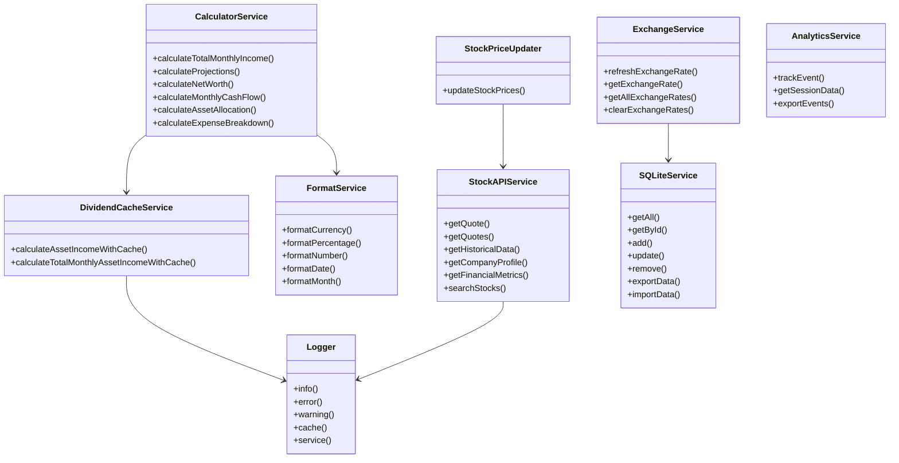
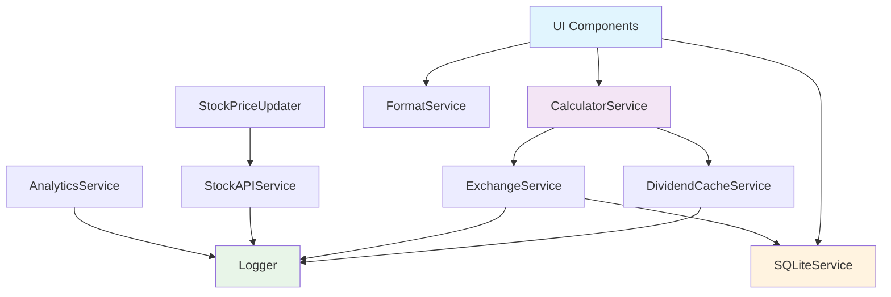
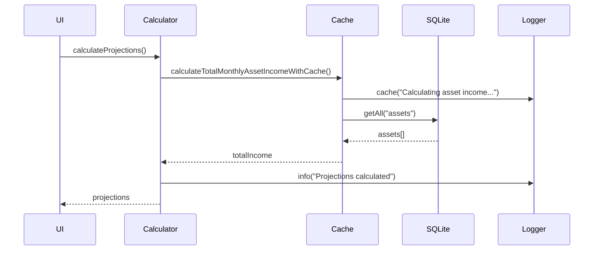

# Service Layer

The service layer encapsulates the business logic and external integrations of the application. It provides reusable functions and classes that are used by containers, views, and other components.

## Architecture
- Each service is organized in its own subfolder or file
- Services are loosely coupled and can be tested and extended independently
- Typical responsibilities: data calculations, API communication, formatting, logging, database operations

## Usage
Services are imported and used in containers, slices, or directly in UI components. Example:

```typescript
import calculatorService from './calculatorService';
const income = calculatorService.calculateTotalMonthlyIncome(incomes);
```

## Core Services Overview

### **calculatorService**
Comprehensive financial calculation engine with methods for:
- Income calculations (monthly, annual, passive income)
- Asset income calculations with caching support
- Expense and liability calculations
- Net worth and cash flow calculations
- Financial projections and forecasting
- Asset and income allocations

### **dividendCacheService**
Optimizes dividend calculations through intelligent caching:
- Caches complex dividend calculations to improve performance
- Manages cache hits/misses for asset income calculations
- Provides total monthly asset income with caching support

### **formatService**
Provides comprehensive formatting utilities:
- Currency formatting with localization
- Percentage formatting with customizable precision
- Number formatting with various options
- Date and month formatting

### **exchangeService**
Manages currency exchange rates:
- Fetches and caches exchange rates
- Provides historical exchange rate data
- Supports date-specific rate queries
- Manages exchange rate persistence

### **stockAPIService** 
Integrates with Yahoo Finance API for market data:
- Real-time stock quotes (single and batch)
- Historical price data
- Company profiles and financial metrics
- Stock events and news
- Options data and search functionality

### **sqlLiteService**
Handles local data persistence with SQLite:
- CRUD operations for all data types (assets, income, expenses, liabilities)
- Data import/export functionality
- Database initialization and schema management
- Type-safe database operations

### **Logger**
Centralized logging system with feature flags:
- Configurable log levels (info, error, warning, cache, service)
- Platform-aware logging (mobile vs web)
- Log storage and export capabilities
- Performance tracking and debugging support

### **Helper Services**
- **stockPriceUpdater**: Batch updates for stock prices with API rate limiting
- **downloadFile**: File download utilities for data export
- **useDeviceCheck**: Device detection and platform-specific functionality
- **analytics**: Event tracking and session analytics

---

## UML Class Diagram


---

## Service Dependencies Flow


---

## Service Interaction Sequence


---

## Key Features

### Performance Optimization
- **Dividend Caching**: Complex dividend calculations are cached to improve performance
- **Batch Operations**: Stock price updates handle multiple assets efficiently with rate limiting
- **Lazy Loading**: Services are instantiated only when needed

### Type Safety
- All services implement TypeScript interfaces
- Strong typing throughout the service layer
- Compile-time error detection

### Error Handling
- Comprehensive error logging through Logger service
- Graceful degradation when external APIs fail
- Robust data validation

### Extensibility
- Interface-based design allows easy mocking for tests
- Modular architecture supports adding new services
- Feature flags enable/disable functionality

---

## Best Practices

### Service Usage
```typescript
// ✅ Good: Import specific service methods
import { calculateNetWorth } from './calculatorService';

// ✅ Good: Use singleton instances
import formatService from './formatService';

// ❌ Avoid: Direct instantiation of services
const logger = new Logger(); // Use Logger.info() instead
```

### Error Handling
```typescript
// ✅ Good: Handle service errors gracefully
try {
  const result = await stockAPIService.getQuote(ticker);
  return result;
} catch (error) {
  Logger.error('Failed to fetch quote', { ticker, error });
  return null;
}
```

### Performance
```typescript
// ✅ Good: Use caching for expensive operations
const income = dividendCacheService.calculateTotalMonthlyAssetIncomeWithCache(assets);

// ✅ Good: Batch operations when possible
const quotes = await stockAPIService.getQuotes(tickers);
```

---

## Testing

Each service includes comprehensive tests covering:
- Unit tests for individual methods
- Integration tests for service interactions
- Mock implementations for external dependencies
- Performance benchmarks for critical calculations

---

## Conclusion

The service layer forms the backbone of the application's business logic, providing a clean separation between UI and data processing. The modular design ensures maintainability, testability, and scalability while the UML diagrams help visualize dependencies and interactions between services.
