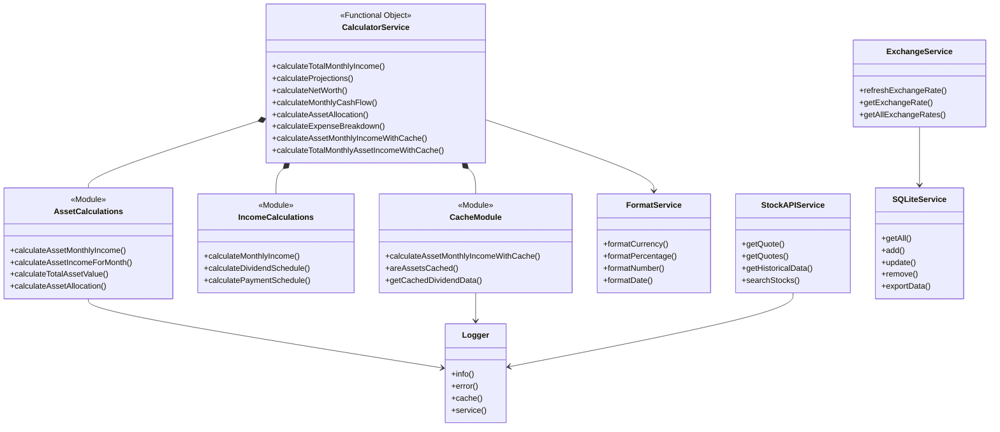
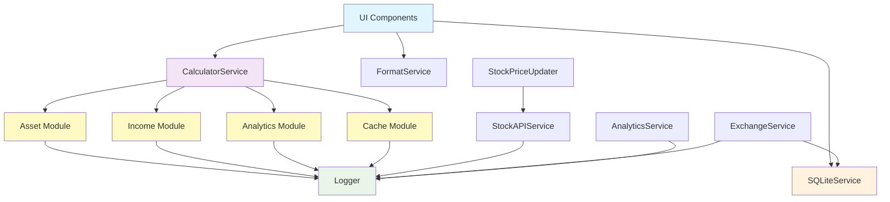
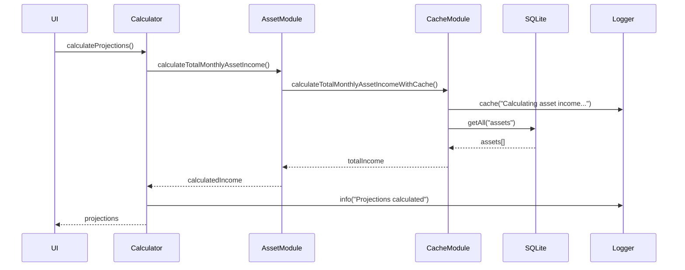

# Service Layer

The service layer encapsulates the business logic and external integrations of the application. It provides reusable functions and classes that are used by containers, views, and other components.

## Architecture & Design Patterns

### **Functional Object Pattern**
Our services implement the **Functional Object Pattern** - a hybrid approach that combines functional programming principles with object-like organization:

```typescript
// Services are implemented as objects containing pure functions
const calculatorService: ICalculatorService = {
  calculateAssetMonthlyIncome: (asset) => { /* pure function logic */ },
  calculateNetWorth: (assets, liabilities) => { /* pure function logic */ },
  // ... more methods
};
```

**Benefits:**
- **Predictable**: Pure functions with no side effects
- **Testable**: Easy to mock and unit test
- **Maintainable**: Clear separation of concerns
- **Type-safe**: Full TypeScript interface compliance

### **Modular Architecture**
- Each service is organized in its own subfolder with specialized modules
- Services are loosely coupled and can be tested and extended independently
- **Folder-based organization** for large services (like calculatorService)
- Typical responsibilities: data calculations, API communication, formatting, logging, database operations

### **Performance-First Design**
- **Integrated caching** eliminates redundant service layers
- **Optimized calculations** with cache-first approaches
- **Batch operations** for expensive computations

## Usage
Services are imported and used in containers, slices, or directly in UI components. Example:

```typescript
import calculatorService from './calculatorService';
const income = calculatorService.calculateTotalMonthlyIncome(incomes);
```

## Core Services Overview

### **calculatorService** 🎯
**Architecture:** Modular folder-based organization with specialized calculation modules

The comprehensive financial calculation engine with **integrated caching** and optimized performance:

**Folder Structure:**
```
calculatorService/
  methods/
    asset/          - Asset income calculations, allocations
    income/         - Income and payment schedule calculations  
    expense/        - Expense calculations and breakdowns
    liability/      - Liability and debt calculations
    analytics/      - Financial projections and analytics
    common/         - General calculations (cash flow, net worth)
  interfaces/       - TypeScript interfaces and contracts
```

**Key Features:**
- **Integrated caching**: Direct cache management without separate service layer
- **Modular design**: Each calculation type in dedicated modules (<150 lines each)
- **Performance optimized**: Cache-first approaches for expensive calculations
- **Type-safe**: Full TypeScript interface compliance

**Core Methods:**
- Asset income calculations with caching support
- Financial projections and forecasting  
- Asset and income allocation analysis
- Net worth and cash flow calculations
- Payment schedule management (dividends, recurring payments)

**Example Usage:**
```typescript
import calculatorService from './calculatorService';

// Basic calculations
const monthlyIncome = calculatorService.calculateAssetMonthlyIncome(asset);
const netWorth = calculatorService.calculateNetWorth(assets, liabilities);

// Cache-optimized calculations
const cachedResult = calculatorService.calculateAssetMonthlyIncomeWithCache(asset);
const projections = calculatorService.calculateProjectionsWithCache(baseValues, cache);

// Analytics
const allocation = calculatorService.calculateAssetAllocation(assets);
const analytics = calculatorService.calculatePortfolioAnalytics(positions);
```

### **formatService**
Provides comprehensive formatting utilities with localization support:
- Currency formatting with locale-specific rules
- Percentage formatting with customizable precision
- Number formatting with various display options
- Date and time formatting utilities

### **exchangeService**
Manages currency exchange rates and conversions:
- Fetches and caches real-time exchange rates
- Provides historical exchange rate data
- Supports date-specific rate queries
- Manages exchange rate persistence in local storage

### **stockAPIService** 
Integrates with Yahoo Finance API for comprehensive market data:
- Real-time stock quotes (single and batch requests)
- Historical price data with customizable timeframes
- Company profiles and fundamental metrics
- Stock events, news, and market data
- Advanced search functionality and options data

### **sqlLiteService**
Handles local data persistence with SQLite database:
- Type-safe CRUD operations for all data entities
- Data import/export functionality with validation
- Database schema management and migrations
- Transaction support for data integrity
- Optimized queries for performance

### **Logger**
Centralized logging system with configurable output:
- Multiple log levels (info, error, warning, cache, service)
- Platform-aware logging (mobile vs web optimizations)
- Log storage, filtering, and export capabilities
- Performance tracking and debugging support
- Feature flags for development vs production

### **Helper Services**
- **stockPriceUpdater**: Intelligent batch updates with API rate limiting
- **downloadFile**: Cross-platform file download utilities
- **useDeviceCheck**: Device detection and platform-specific features
- **analytics**: Event tracking, session management, and user analytics

---

## Architecture Patterns & Design Principles

### **1. Functional Object Pattern**
```typescript
// Implementation example
const calculatorService: ICalculatorService = {
  // Pure functions with predictable inputs/outputs
  calculateNetWorth: (assets, liabilities) => assets.total - liabilities.total,
  
  // Complex calculations with integrated caching
  calculateAssetMonthlyIncomeWithCache: (asset) => {
    const cached = getCachedResult(asset);
    return cached || calculateAndCache(asset);
  }
};
```

### **2. Modular Service Architecture**
```
Large services are broken into focused modules:
calculatorService/
  ├── methods/
  │   ├── asset/           - Asset-specific calculations
  │   ├── income/          - Income processing
  │   ├── expense/         - Expense management  
  │   ├── liability/       - Debt calculations
  │   ├── analytics/       - Complex analytics
  │   └── common/          - Shared utilities
  ├── interfaces/          - TypeScript contracts
  └── index.ts            - Main service export
```

### **3. Performance-First Design**
- **Cache Integration**: Direct cache management eliminates service layer overhead
- **Batch Operations**: Multiple calculations optimized in single operations
- **Lazy Loading**: Expensive calculations only when needed
- **Memoization**: Results cached at function level

### **4. Type Safety & Contracts**
```typescript
// Every service implements strict interfaces
interface ICalculatorService {
  calculateAssetMonthlyIncome(asset: Asset): number;
  calculateNetWorth(assets: Asset[], liabilities: Liability[]): number;
  // ... all methods strongly typed
}
```

---

## UML Class Diagram


---

## Service Dependencies Flow


---

## Service Interaction Sequence


---

## Key Features & Architectural Benefits

### **Performance Optimization**
- **Integrated Caching**: Cache management built directly into calculatorService eliminates overhead
- **Batch Operations**: Stock price updates and calculations handle multiple assets efficiently
- **Cache-First Strategy**: Expensive calculations check cache before computing
- **Optimized Modules**: Large calculation files split into focused modules (<150 lines each)

### **Maintainability & Organization**
- **Modular Structure**: Each service broken into logical, focused modules
- **Clear Separation**: Business logic separated by domain (assets, income, expenses, etc.)
- **Small Files**: No file exceeds 150 lines, improving readability and maintenance
- **Facade Pattern**: Main service files act as clean entry points

### **Type Safety & Reliability** 
- **Interface Contracts**: All services implement strict TypeScript interfaces
- **Compile-time Validation**: Strong typing catches errors before runtime
- **Consistent APIs**: Uniform function signatures across all services
- **Error Boundaries**: Comprehensive error handling with graceful degradation

### **Extensibility & Testing**
- **Interface-based Design**: Easy mocking and testing of individual modules
- **Loose Coupling**: Services can be extended without affecting others
- **Pure Functions**: Predictable, testable business logic
- **Feature Flags**: Enable/disable functionality for different environments

---

## Refactoring Achievement: From Complexity to Clarity

### **Before: Redundant Abstraction**
```typescript
// Old pattern: Unnecessary service layer
dividendCacheService.calculateTotalMonthlyAssetIncomeWithCache()
  ↓ delegates to
calculatorService.calculateTotalMonthlyAssetIncome()
  ↓ with caching logic scattered
```

### **After: Integrated & Efficient**
```typescript
// New pattern: Direct, optimized approach
calculatorService.calculateTotalMonthlyAssetIncomeWithCache()
  ↓ direct cache integration
  ↓ no unnecessary abstraction layers
```

**Benefits Achieved:**
- ✅ **Eliminated redundancy**: Removed unnecessary dividendCacheService layer
- ✅ **Improved performance**: Direct cache integration without service overhead  
- ✅ **Better organization**: Modular folder structure with focused responsibilities
- ✅ **Enhanced maintainability**: Files under 150 lines, clear separation of concerns
- ✅ **Consistent patterns**: Uniform functional object pattern across all services

---

## Best Practices & Implementation Guidelines

### **Service Usage Patterns**
```typescript
// ✅ RECOMMENDED: Import service instances
import calculatorService from './calculatorService';
const income = calculatorService.calculateTotalMonthlyIncome(incomes);

// ✅ RECOMMENDED: Use cache-optimized methods for expensive operations
const cachedIncome = calculatorService.calculateTotalMonthlyAssetIncomeWithCache(assets);

// ✅ RECOMMENDED: Leverage modular architecture
import { calculateAssetAllocation } from './calculatorService/methods/asset/calculateAllocations';

// ❌ AVOID: Direct module imports bypass service interface
import { someInternalFunction } from './calculatorService/methods/asset/internal';
```

### **Error Handling Best Practices**
```typescript
// ✅ RECOMMENDED: Graceful service error handling
try {
  const result = await stockAPIService.getQuote(ticker);
  return result;
} catch (error) {
  Logger.error('Failed to fetch quote', { ticker, error });
  return null; // Graceful degradation
}

// ✅ RECOMMENDED: Validation before service calls
if (!Array.isArray(assets) || assets.length === 0) {
  Logger.warning('Invalid assets provided to calculator');
  return 0;
}
```

### **Performance Optimization Patterns**
```typescript
// ✅ RECOMMENDED: Cache-first strategy
const income = calculatorService.calculateTotalMonthlyAssetIncomeWithCache(assets);

// ✅ RECOMMENDED: Batch operations for multiple items
const quotes = await stockAPIService.getQuotes(tickers);

// ✅ RECOMMENDED: Check cache availability before expensive calculations
if (calculatorService.areAssetsCached(assets)) {
  return calculatorService.calculateTotalMonthlyAssetIncomeFromCache(assets);
}

// ❌ AVOID: Repeated expensive calculations without caching
assets.forEach(asset => calculatorService.calculateAssetMonthlyIncome(asset)); // Inefficient
```

### **Module Organization Guidelines**
```typescript
// ✅ RECOMMENDED: Keep modules focused and under 150 lines
// asset/calculateAssetIncome.ts - Asset income calculations only
// income/calculatePayment.ts - Payment schedule logic only
// analytics/calculateProjections.ts - Projection calculations only

// ✅ RECOMMENDED: Use facade pattern for complex services
// Main service file re-exports from specialized modules
export { calculateAssetMonthlyIncome } from './methods/asset/calculateAssetIncomeCore';
export { calculateProjections } from './methods/analytics/calculateProjections';
```

---

## Testing Strategy

### **Unit Testing Approach**
```typescript
describe('CalculatorService', () => {
  it('should calculate net worth correctly', () => {
    const assets = [{ value: 1000 }, { value: 2000 }];
    const liabilities = [{ amount: 500 }];
    
    const result = calculatorService.calculateNetWorth(3000, 500);
    expect(result).toBe(2500);
  });
  
  it('should use cache when available', () => {
    const mockAsset = createMockAsset();
    jest.spyOn(cacheUtils, 'getCachedDividendData').mockReturnValue({ monthlyAmount: 100 });
    
    const result = calculatorService.calculateAssetMonthlyIncomeWithCache(mockAsset);
    expect(result.cacheHit).toBe(true);
    expect(result.monthlyAmount).toBe(100);
  });
});
```

### **Integration Testing**
- **Service Interactions**: Test how services work together
- **Performance Benchmarks**: Verify caching improves performance
- **Error Scenarios**: Test graceful degradation when dependencies fail
- **Mock Implementations**: Mock external dependencies (APIs, databases)

---

## Migration Guide: From Old to New Architecture

If migrating from the old architecture with separate `dividendCacheService`:

### **Step 1: Update Imports**
```typescript
// OLD
import { getDividendCacheService } from './dividendCacheService';
const cacheService = getDividendCacheService();
const income = cacheService.calculateTotalMonthlyAssetIncomeWithCache(assets);

// NEW
import calculatorService from './calculatorService';
const income = calculatorService.calculateTotalMonthlyAssetIncomeWithCache(assets);
```

### **Step 2: Use New Cache Methods**
```typescript
// OLD - Separate cache service calls
const cacheService = getDividendCacheService();
const isValid = cacheService.areAssetsCached(assets);
const total = cacheService.calculateTotalMonthlyAssetIncomeFromCache(assets);

// NEW - Integrated cache methods
const isValid = calculatorService.areAssetsCached(assets);
const total = calculatorService.calculateTotalMonthlyAssetIncomeFromCache(assets);
```

### **Step 3: Remove Old Dependencies**
- Remove imports of `dividendCacheService`
- Update Redux slices to use `calculatorService` directly
- Remove any `getDividendCacheService()` calls

---

## Conclusion

The service layer represents a **carefully architected foundation** that balances performance, maintainability, and extensibility. Through the **Functional Object Pattern** and **modular organization**, we've created a system that:

- **Eliminates redundancy** while maintaining all functionality
- **Optimizes performance** through integrated caching strategies  
- **Ensures maintainability** with focused, small modules
- **Provides reliability** through strong typing and error handling
- **Supports extensibility** via clean interfaces and loose coupling

The recent refactoring successfully transformed a complex, multi-layered architecture into a **streamlined, efficient system** that serves as the backbone for all financial calculations and business logic in the application.
