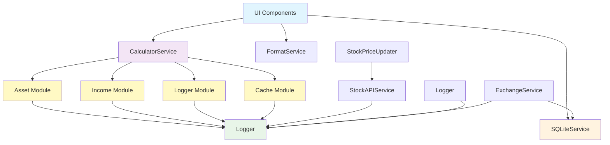

# Service Layer

The service layer encapsulates the comprehensive financial calculation and business logic of the Passive Income Calculator application. It provides reusable functions and classes for complete financial health management including assets, liabilities, income, expenses, forecasting, and milestone tracking.

## Architecture & Design Patterns

### **Functional Object Pattern**
Our services implement the **Functional Object Pattern** - a hybrid approach that combines functional programming principles with object-like organization:

```typescript
// Services are implemented as objects containing pure functions
const calculatorService: ICalculatorService = {
  calculateAssetMonthlyIncome: (asset) => { /* pure function logic */ },
  calculateNetWorth: (assets, liabilities) => { /* pure function logic */ },
  calculateDebtAnalytics: (liabilities) => { /* comprehensive debt analysis */ },
  calculateFinancialHealth: (portfolio) => { /* holistic health scoring */ },
  // ... more methods for complete financial management
};
```

**Benefits:**
- **Predictable**: Pure functions with no side effects
- **Testable**: Easy to mock and unit test
- **Maintainable**: Clear separation of concerns
- **Type-safe**: Full TypeScript interface compliance
- **Holistic**: Comprehensive financial calculations across all domains

### **Modular Architecture**
- Each service is organized in its own subfolder with specialized modules
- Services are loosely coupled and can be tested and extended independently
- **Folder-based organization** for large services (like calculatorService)
- Comprehensive responsibilities: portfolio management, debt analysis, cash flow forecasting, expense tracking, income optimization, milestone tracking, and financial health assessment

### **Performance-First Design**
- **Integrated caching** eliminates redundant service layers
- **Optimized calculations** with cache-first approaches
- **Batch operations** for expensive computations
- **Cross-domain analytics** with efficient data sharing

## Usage
Services are imported and used in containers, slices, or directly in UI components. Example:

```typescript
import calculatorService from './calculatorService';
const income = calculatorService.calculateTotalMonthlyIncome(incomes);
const debtAnalysis = calculatorService.calculateLiabilityAnalytics(liabilities);
const milestoneProgress = calculatorService.calculateMilestoneProgress(portfolio);
```

## Core Services Overview

### **calculatorService** 🎯
**Architecture:** Modular folder-based organization with specialized calculation modules

The comprehensive financial calculation engine with **integrated caching** and optimized performance for complete financial health management:

**Folder Structure:**
```
calculatorService/
  methods/
    asset/          - Portfolio income calculations, allocations, performance analysis
    income/         - Income streams and payment schedule calculations  
    expense/        - Expense tracking, categorization, and budget analysis
    liability/      - Debt management, payoff strategies, interest optimization
    analytics/      - Cross-domain projections, forecasting, and health metrics
    common/         - General calculations (cash flow, net worth, milestones)
  interfaces/       - TypeScript interfaces and contracts
```

**Key Features:**
- **Integrated caching**: Direct cache management without separate service layer
- **Modular design**: Each calculation type in dedicated modules (<150 lines each)
- **Performance optimized**: Cache-first approaches for expensive calculations
- **Type-safe**: Full TypeScript interface compliance
- **Comprehensive analytics**: Cross-domain financial health assessment
- **Milestone tracking**: Goal progress and achievement calculations
- **Debt optimization**: Advanced payoff strategies and interest analysis

**Core Methods:**
- Portfolio income calculations with dividend scheduling and caching support
- Comprehensive debt analytics including payoff strategies and interest optimization
- Financial projections and forecasting across all financial domains
- Asset and income allocation analysis with risk assessment
- Net worth and cash flow calculations with trend analysis
- Payment schedule management (dividends, debt payments, recurring expenses)
- Milestone progress tracking and goal achievement calculations
- Financial health scoring and recommendation generation

**Example Usage:**
```typescript
import calculatorService from './calculatorService';

// Portfolio management
const monthlyIncome = calculatorService.calculateAssetMonthlyIncome(asset);
const allocation = calculatorService.calculateAssetAllocation(assets);

// Debt management
const debtAnalysis = calculatorService.calculateLiabilityAnalytics(liabilities);
const payoffStrategy = calculatorService.calculateDebtPayoffStrategy(debts);

// Comprehensive analysis
const netWorth = calculatorService.calculateNetWorth(assets, liabilities);
const financialHealth = calculatorService.calculateFinancialHealthScore(portfolio);

// Forecasting and milestones
const projections = calculatorService.calculateProjectionsWithCache(baseValues, cache);
const milestoneProgress = calculatorService.calculateMilestoneProgress(data);

// Cache-optimized calculations
const cachedResult = calculatorService.calculateAssetMonthlyIncomeWithCache(asset);
```

### **formatService**
Provides comprehensive formatting utilities with localization support for financial data:
- Currency formatting with locale-specific rules and multi-currency support
- Percentage formatting with customizable precision for returns and ratios
- Number formatting with various display options for large financial figures
- Date and time formatting utilities for transaction and milestone tracking
- Financial ratio formatting (debt-to-income, expense ratios, etc.)

### **exchangeService**
Manages multi-currency exchange rates and conversions for global portfolio management:
- Fetches and caches real-time exchange rates for portfolio valuation
- Provides historical exchange rate data for performance analysis
- Supports date-specific rate queries for accurate historical calculations
- Manages exchange rate persistence in local storage for offline functionality
- Currency conversion utilities for multi-currency portfolio management

### **stockAPIService** 
Integrates with financial APIs for comprehensive market data and portfolio management:
- Real-time stock quotes (single and batch requests) for portfolio valuation
- Historical price data with customizable timeframes for performance analysis
- Company profiles and fundamental metrics for investment research
- Stock events, dividends, and earnings data for income forecasting
- Advanced search functionality and market data for portfolio expansion
- Price alerts and monitoring for active portfolio management

### **sqlLiteService**
Handles local data persistence with SQLite database for comprehensive financial data:
- Type-safe CRUD operations for all financial entities (assets, liabilities, income, expenses)
- Data import/export functionality with validation for backup and migration
- Database schema management and migrations for data integrity
- Transaction support for multi-table financial operations
- Optimized queries for performance with financial data relationships
- Audit trail and versioning for financial data compliance

### **Logger**
Centralized logging system with configurable output optimized for financial applications:
- Multiple log levels (info, error, warning, cache, service, financial)
- Platform-aware logging (mobile vs web optimizations)
- Log storage, filtering, and export capabilities for debugging and compliance
- Performance tracking and debugging support for financial calculations
- Feature flags for development vs production environments
- Security-aware logging for sensitive financial data handling

### **Helper Services**
- **stockPriceUpdater**: Intelligent batch updates with API rate limiting for portfolio management
- **downloadFile**: Cross-platform file download utilities for financial reports and exports
- **useDeviceCheck**: Device detection and platform-specific features for mobile financial apps
- **analytics**: Event tracking, session management, and user analytics for financial app usage
- **milestoneTracker**: Goal progress monitoring and achievement notifications
- **debtOptimizer**: Advanced debt payoff strategy calculations and recommendations

---

## Architecture Patterns & Design Principles

### **1. Functional Object Pattern**
```typescript
// Implementation example for comprehensive financial calculations
const calculatorService: ICalculatorService = {
  // Portfolio management functions
  calculateNetWorth: (assets, liabilities) => assets.total - liabilities.total,
  calculateAssetAllocation: (assets) => groupByType(assets),
  
  // Debt management functions
  calculateDebtPayoffStrategy: (debts) => optimizePayoffOrder(debts),
  calculateInterestSavings: (strategy) => calculateSavings(strategy),
  
  // Complex calculations with integrated caching
  calculateAssetMonthlyIncomeWithCache: (asset) => {
    const cached = getCachedResult(asset);
    return cached || calculateAndCache(asset);
  },
  
  // Cross-domain analytics
  calculateFinancialHealthScore: (portfolio) => assessFinancialHealth(portfolio),
  calculateMilestoneProgress: (goals, current) => trackProgress(goals, current)
};
```

### **2. Modular Service Architecture**
```
Large services are broken into focused modules:
calculatorService/
  ├── methods/
  │   ├── asset/           - Asset-specific calculations
  │   ├── income/          - Income processing
  │   ├── expense/         - Expense management  
  │   ├── liability/       - Debt calculations
  │   ├── analytics/       - Complex analytics
  │   └── common/          - Shared utilities
  ├── interfaces/          - TypeScript contracts
  └── index.ts            - Main service export
```

### **3. Performance-First Design**
- **Cache Integration**: Direct cache management eliminates service layer overhead
- **Batch Operations**: Multiple calculations optimized in single operations
- **Lazy Loading**: Expensive calculations only when needed
- **Memoization**: Results cached at function level

### **4. Type Safety & Contracts**
```typescript
// Every service implements strict interfaces
interface ICalculatorService {
  calculateAssetMonthlyIncome(asset: Asset): number;
  calculateNetWorth(assets: Asset[], liabilities: Liability[]): number;
  // ... all methods strongly typed
}
```

---

## UML Class Diagram


---

## Service Dependencies Flow


---

## Service Interaction Sequence


---

## Key Features & Architectural Benefits

### **Performance Optimization**
- **Integrated Caching**: Cache management built directly into calculatorService eliminates overhead
- **Batch Operations**: Stock price updates and calculations handle multiple assets efficiently
- **Cache-First Strategy**: Expensive calculations check cache before computing
- **Optimized Modules**: Large calculation files split into focused modules (<150 lines each)

### **Maintainability & Organization**
- **Modular Structure**: Each service broken into logical, focused modules
- **Clear Separation**: Business logic separated by domain (assets, income, expenses, etc.)
- **Small Files**: No file exceeds 150 lines, improving readability and maintenance
- **Facade Pattern**: Main service files act as clean entry points

### **Type Safety & Reliability** 
- **Interface Contracts**: All services implement strict TypeScript interfaces
- **Compile-time Validation**: Strong typing catches errors before runtime
- **Consistent APIs**: Uniform function signatures across all services
- **Error Boundaries**: Comprehensive error handling with graceful degradation

### **Extensibility & Testing**
- **Interface-based Design**: Easy mocking and testing of individual modules
- **Loose Coupling**: Services can be extended without affecting others
- **Pure Functions**: Predictable, testable business logic
- **Feature Flags**: Enable/disable functionality for different environments

---

## Refactoring Achievement: From Complexity to Clarity

### **Before: Redundant Abstraction**
```typescript
// Old pattern: Unnecessary service layer
dividendCacheService.calculateTotalMonthlyAssetIncomeWithCache()
  ↓ delegates to
calculatorService.calculateTotalMonthlyAssetIncome()
  ↓ with caching logic scattered
```

### **After: Integrated & Efficient**
```typescript
// New pattern: Direct, optimized approach
calculatorService.calculateTotalMonthlyAssetIncomeWithCache()
  ↓ direct cache integration
  ↓ no unnecessary abstraction layers
```

**Benefits Achieved:**
- ✅ **Eliminated redundancy**: Removed unnecessary dividendCacheService layer
- ✅ **Improved performance**: Direct cache integration without service overhead  
- ✅ **Better organization**: Modular folder structure with focused responsibilities
- ✅ **Enhanced maintainability**: Files under 150 lines, clear separation of concerns
- ✅ **Consistent patterns**: Uniform functional object pattern across all services

---

## Best Practices & Implementation Guidelines

### **Service Usage Patterns**
```typescript
// ✅ RECOMMENDED: Import service instances
import calculatorService from './calculatorService';
const income = calculatorService.calculateTotalMonthlyIncome(incomes);

// ✅ RECOMMENDED: Use cache-optimized methods for expensive operations
const cachedIncome = calculatorService.calculateTotalMonthlyAssetIncomeWithCache(assets);

// ✅ RECOMMENDED: Leverage modular architecture
import { calculateAssetAllocation } from './calculatorService/methods/asset/calculateAllocations';

// ❌ AVOID: Direct module imports bypass service interface
import { someInternalFunction } from './calculatorService/methods/asset/internal';
```

### **Error Handling Best Practices**
```typescript
// ✅ RECOMMENDED: Graceful service error handling
try {
  const result = await stockAPIService.getQuote(ticker);
  return result;
} catch (error) {
  Logger.error('Failed to fetch quote', { ticker, error });
  return null; // Graceful degradation
}

// ✅ RECOMMENDED: Validation before service calls
if (!Array.isArray(assets) || assets.length === 0) {
  Logger.warning('Invalid assets provided to calculator');
  return 0;
}
```

### **Performance Optimization Patterns**
```typescript
// ✅ RECOMMENDED: Cache-first strategy
const income = calculatorService.calculateTotalMonthlyAssetIncomeWithCache(assets);

// ✅ RECOMMENDED: Batch operations for multiple items
const quotes = await stockAPIService.getQuotes(tickers);

// ✅ RECOMMENDED: Check cache availability before expensive calculations
if (calculatorService.areAssetsCached(assets)) {
  return calculatorService.calculateTotalMonthlyAssetIncomeFromCache(assets);
}

// ❌ AVOID: Repeated expensive calculations without caching
assets.forEach(asset => calculatorService.calculateAssetMonthlyIncome(asset)); // Inefficient
```

### **Module Organization Guidelines**
```typescript
// ✅ RECOMMENDED: Keep modules focused and under 150 lines
// asset/calculateAssetIncome.ts - Asset income calculations only
// income/calculatePayment.ts - Payment schedule logic only
// analytics/calculateProjections.ts - Projection calculations only

// ✅ RECOMMENDED: Use facade pattern for complex services
// Main service file re-exports from specialized modules
export { calculateAssetMonthlyIncome } from './methods/asset/calculateAssetIncomeCore';
export { calculateProjections } from './methods/analytics/calculateProjections';
```

---

## Testing Strategy

### **Unit Testing Approach**
```typescript
describe('CalculatorService', () => {
  it('should calculate net worth correctly', () => {
    const assets = [{ value: 1000 }, { value: 2000 }];
    const liabilities = [{ amount: 500 }];
    
    const result = calculatorService.calculateNetWorth(3000, 500);
    expect(result).toBe(2500);
  });
  
  it('should use cache when available', () => {
    const mockAsset = createMockAsset();
    jest.spyOn(cacheUtils, 'getCachedDividendData').mockReturnValue({ monthlyAmount: 100 });
    
    const result = calculatorService.calculateAssetMonthlyIncomeWithCache(mockAsset);
    expect(result.cacheHit).toBe(true);
    expect(result.monthlyAmount).toBe(100);
  });
});
```

### **Integration Testing**
- **Service Interactions**: Test how services work together
- **Performance Benchmarks**: Verify caching improves performance
- **Error Scenarios**: Test graceful degradation when dependencies fail
- **Mock Implementations**: Mock external dependencies (APIs, databases)

---

## Migration Guide: From Old to New Architecture

If migrating from the old architecture with separate `dividendCacheService`:

### **Step 1: Update Imports**
```typescript
// OLD
import { getDividendCacheService } from './dividendCacheService';
const cacheService = getDividendCacheService();
const income = cacheService.calculateTotalMonthlyAssetIncomeWithCache(assets);

// NEW
import calculatorService from './calculatorService';
const income = calculatorService.calculateTotalMonthlyAssetIncomeWithCache(assets);
```

### **Step 2: Use New Cache Methods**
```typescript
// OLD - Separate cache service calls
const cacheService = getDividendCacheService();
const isValid = cacheService.areAssetsCached(assets);
const total = cacheService.calculateTotalMonthlyAssetIncomeFromCache(assets);

// NEW - Integrated cache methods
const isValid = calculatorService.areAssetsCached(assets);
const total = calculatorService.calculateTotalMonthlyAssetIncomeFromCache(assets);
```

### **Step 3: Remove Old Dependencies**
- Remove imports of `dividendCacheService`
- Update Redux slices to use `calculatorService` directly
- Remove any `getDividendCacheService()` calls

---

## Conclusion

The service layer represents a **carefully architected foundation** that balances performance, maintainability, and extensibility. Through the **Functional Object Pattern** and **modular organization**, we've created a system that:

- **Eliminates redundancy** while maintaining all functionality
- **Optimizes performance** through integrated caching strategies  
- **Ensures maintainability** with focused, small modules
- **Provides reliability** through strong typing and error handling
- **Supports extensibility** via clean interfaces and loose coupling

The recent refactoring successfully transformed a complex, multi-layered architecture into a **streamlined, efficient system** that serves as the backbone for all financial calculations and business logic in the application.
