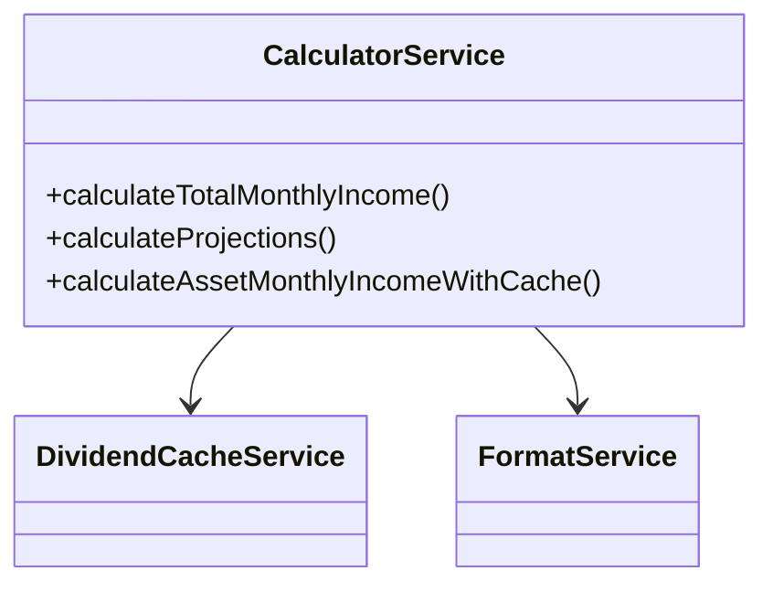
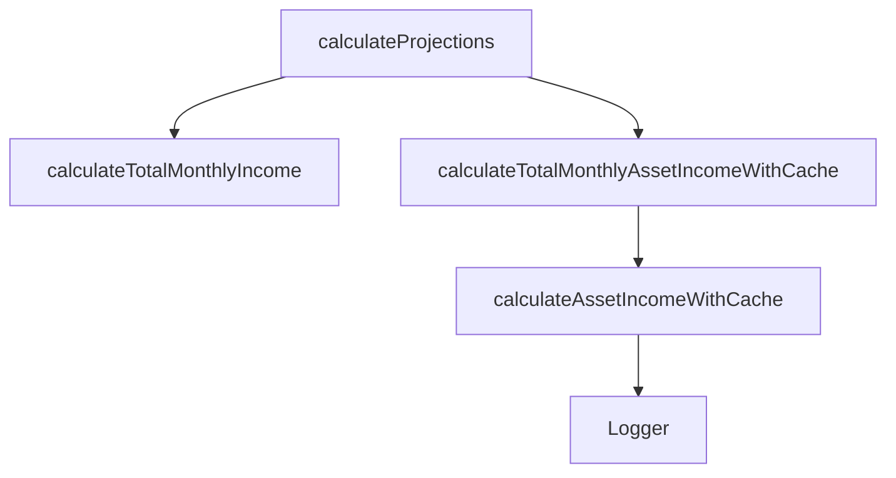
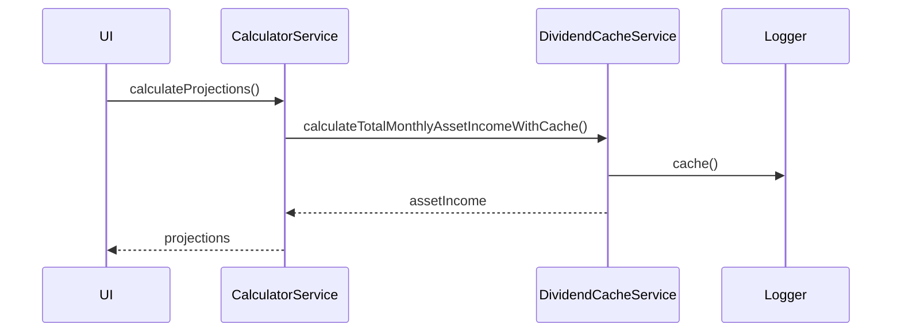

# calculatorService

The `calculatorService` provides all core financial calculations for the application, including projections, asset income, and monthly/annual summaries. It encapsulates business logic for financial planning and is used throughout the app in containers, Redux slices, and UI components.

## Purpose
- Centralizes all financial calculation logic (income, expenses, assets, liabilities, projections).
- Ensures consistency and testability of business rules.
- Decouples calculation logic from UI and data storage.

## Usage
Import and use the service in containers, Redux slices, or directly in UI components:

```typescript
import calculatorService from '../service/calculatorService';
const monthlyIncome = calculatorService.calculateTotalMonthlyIncome(incomes);
const projections = calculatorService.calculateProjections(incomes, expenses, liabilities, assets);
```

## Structure
- Exposes functions for all major calculations (monthly/annual income, projections, asset income, etc.).
- Uses helper services (e.g., `dividendCacheService`, `formatService`) for specialized tasks.
- Designed as a singleton for stateless, reusable logic.

## Example UML Class Diagram


## Example Method Dependency Diagram


## Example Sequence Diagram (Internal Flow)


---

The `calculatorService` is the backbone of the business logic, ensuring all financial calculations are robust, reusable, and easy to maintain.
