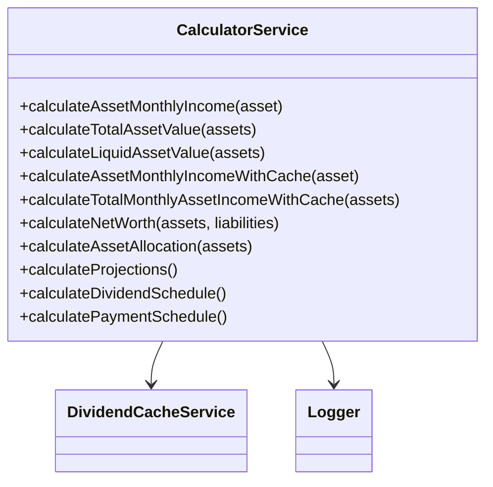
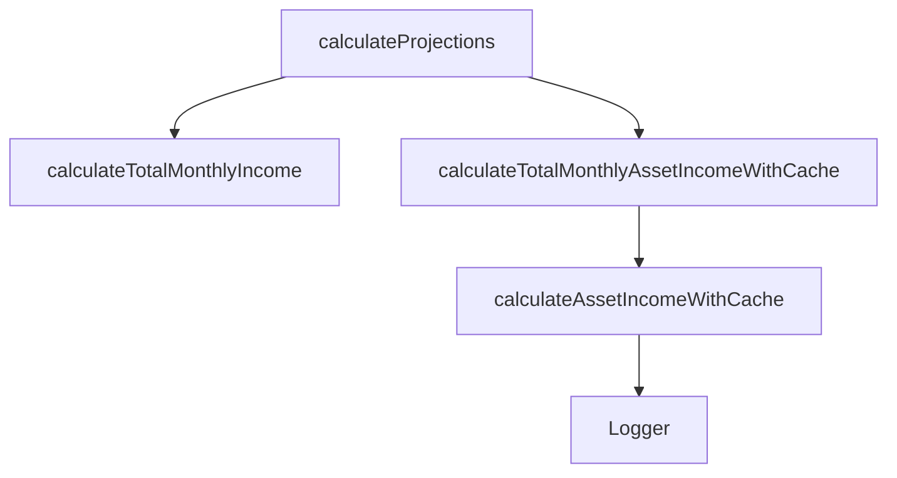
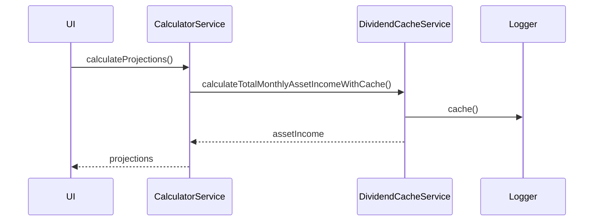

# calculatorService

The `calculatorService` handles comprehensive financial calculations for all asset types, income, liabilities, and expenses. It provides methods for asset income calculations, cash flow analysis, allocation calculations, and financial projections with integrated caching support.

## Purpose
- Calculates asset income from stocks (dividends), bonds/cash (interest), and real estate (rental income)
- Handles payment schedule calculations for dividends and other recurring payments
- Calculates total asset values, liquid asset values, and net worth
- Provides liability calculations including debt and monthly payments
- Supports income and expense calculations with categorization
- Offers advanced analytics like asset allocation, income allocation, and expense breakdowns
- Includes financial projections with monthly breakdowns
- Integrates caching mechanisms for performance optimization of repeated calculations

## Usage
Import and use the service in containers, Redux slices, or other calculation modules:

```typescript
import calculatorService from '../service/calculatorService';

// Asset calculations
const monthlyIncome = calculatorService.calculateAssetMonthlyIncome(asset);
const totalValue = calculatorService.calculateTotalAssetValue(assets);
const liquidValue = calculatorService.calculateLiquidAssetValue(assets);

// Cached calculations for better performance
const cachedResult = calculatorService.calculateAssetMonthlyIncomeWithCache(asset);
const totalMonthlyIncome = calculatorService.calculateTotalMonthlyAssetIncomeWithCache(assets);

// Financial analysis
const allocation = calculatorService.calculateAssetAllocation(assets);
const projections = calculatorService.calculateProjections(assets, incomes, liabilities, expenses);
const netWorth = calculatorService.calculateNetWorth(assets, liabilities);
const cashFlow = calculatorService.calculateMonthlyCashFlow(totalIncome, totalExpenses);
```

## Structure
- **Asset Calculations**: Methods for calculating monthly/annual income from different asset types
- **Cached Calculations**: Performance-optimized versions that use dividend cache service
- **Payment Schedules**: Handles dividend schedules and recurring payment calculations
- **Financial Analysis**: Asset allocation, income allocation, expense breakdown calculations
- **Projections**: Monthly financial projections with detailed breakdowns
- **Utility Methods**: Net worth, cash flow, and ratio calculations
- **Integration**: Works with dividendCacheService for performance optimization

## Key Methods
- `calculateAssetMonthlyIncome(asset)` - Calculate monthly income from any asset type
- `calculateTotalAssetValue(assets)` - Sum total value of all assets
- `calculateLiquidAssetValue(assets)` - Sum value of liquid assets (stocks, bonds, cash)
- `calculateAssetMonthlyIncomeWithCache(asset)` - Cached version with performance optimization
- `calculateTotalMonthlyAssetIncomeWithCache(assets)` - Cached total income calculation
- `calculateNetWorth(assets, liabilities)` - Calculate net worth
- `calculateAssetAllocation(assets)` - Calculate allocation percentages by asset type
- `calculateProjections(assets, incomes, liabilities, expenses)` - Monthly financial projections
- `calculateDividendSchedule(schedule, quantity)` - Handle dividend payment schedules
- `calculatePaymentSchedule(schedule)` - Handle recurring payment schedules

## Example UML Class Diagram


## Example Method Dependency Diagram


## Example Sequence Diagram (Internal Flow)


---

The `calculatorService` is the backbone of the business logic, ensuring all financial calculations are robust, reusable, and easy to maintain.
