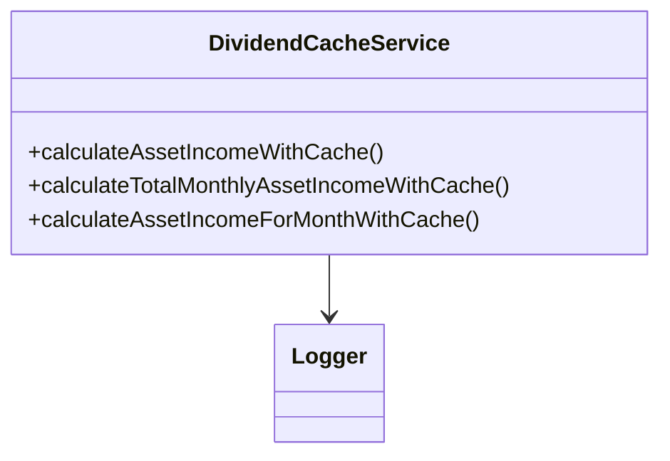
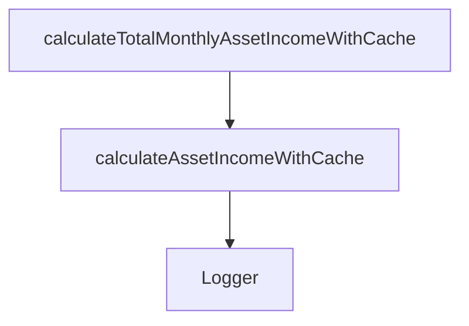
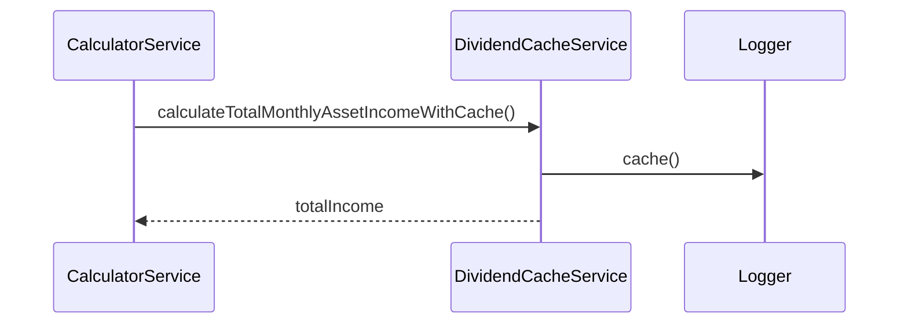

# dividendCacheService

The `dividendCacheService` optimizes dividend and asset income calculations by caching results, reducing redundant computations and improving performance. It is used by the calculator service and other modules that require efficient dividend calculations.

## Purpose
- Caches dividend and asset income calculations for each asset and month.
- Reduces computational overhead for repeated queries.
- Ensures up-to-date results by invalidating cache when asset data changes.

## Usage
Import and use the service in calculation modules or directly in the calculator service:

```typescript
import dividendCacheService from '../service/dividendCacheService';
const result = dividendCacheService.calculateAssetIncomeWithCache(asset);
const total = dividendCacheService.calculateTotalMonthlyAssetIncomeWithCache(assets);
```

## Structure
- Provides methods for per-asset and per-month caching.
- Integrates with Logger for cache hit/miss reporting.
- Used as a singleton for stateless, reusable logic.

## Example UML Class Diagram


## Example Method Dependency Diagram


## Example Sequence Diagram (Internal Flow)


---

The `dividendCacheService` is essential for high-performance financial calculations, ensuring that repeated queries are fast and up-to-date.
