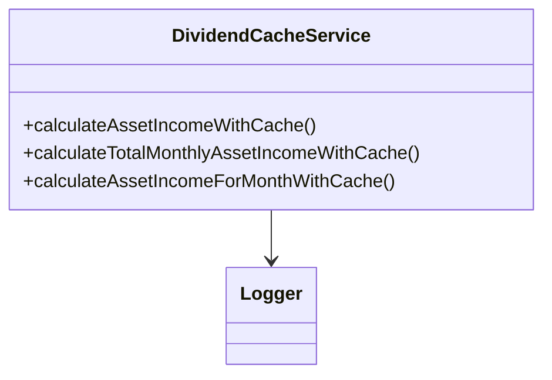
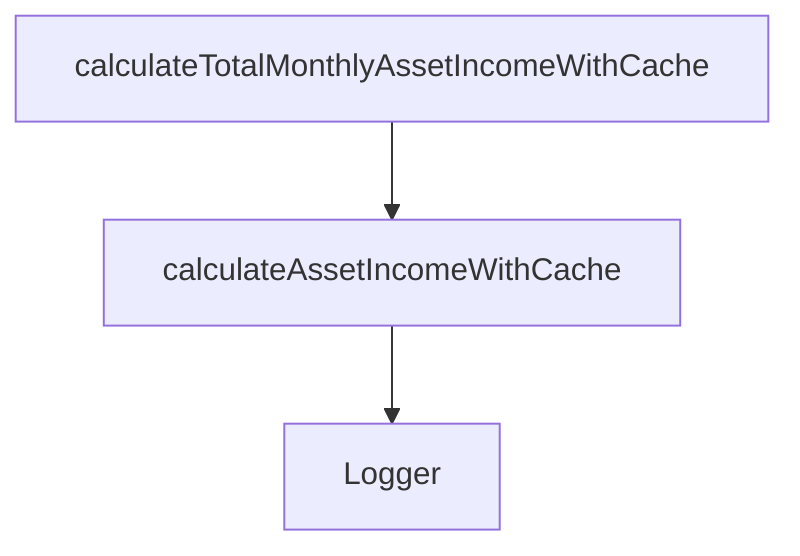
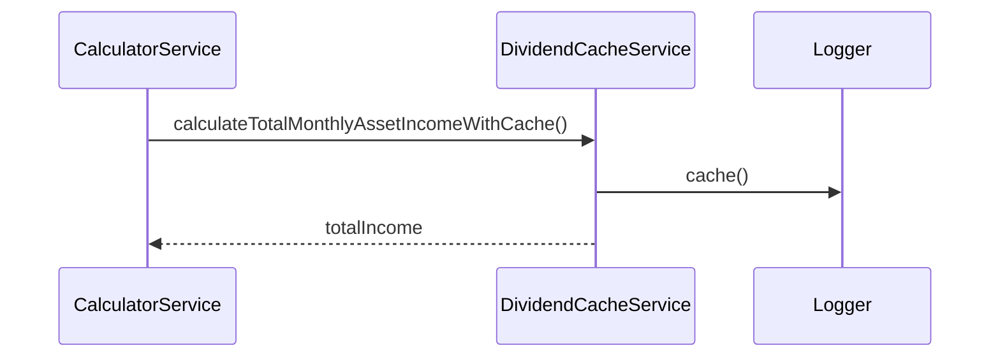

# dividendCacheService

The `dividendCacheService` optimizes dividend and asset income calculations by providing caching mechanisms for frequently calculated values. It reduces computational overhead for repeated asset income queries and integrates seamlessly with the calculator service.

## Purpose
- Caches asset income calculations to avoid redundant computations
- Provides cached versions of monthly and annual income calculations
- Supports monthly breakdown caching for detailed projections
- Tracks cache hit/miss ratios for performance monitoring
- Integrates with the calculator service's caching layer
- Maintains backward compatibility with Redux dispatch patterns

## Usage
Import and use the service in calculation modules or through the calculator service:

```typescript
import { createDividendCacheService } from '../service/dividendCacheService';

// Create service instance (requires Redux dispatch for compatibility)
const cacheService = createDividendCacheService(dispatch);

// Calculate asset income with caching
const result = cacheService.calculateAssetIncomeWithCache(asset);
console.log(`Monthly: ${result.monthlyAmount}, Cache Hit: ${result.cacheHit}`);

// Calculate total income for all assets with caching
const totalIncome = cacheService.calculateTotalMonthlyAssetIncomeWithCache(assets);

// Calculate income for specific month with caching
const monthlyIncome = cacheService.calculateAssetIncomeForMonthWithCache(asset, 6);

// Calculate total income for specific month
const totalMonthlyIncome = cacheService.calculateTotalAssetIncomeForMonthWithCache(assets, 6);
```

## Structure
- **Singleton Pattern**: Uses factory pattern to maintain single instance
- **Cache Integration**: Leverages existing dividend cache utilities from calculator service
- **Performance Monitoring**: Logs cache hits and misses for optimization insights
- **Monthly Breakdown**: Supports detailed month-by-month income calculations
- **Backward Compatibility**: Maintains Redux dispatch parameter for legacy support

## Key Methods
- `calculateAssetIncomeWithCache(asset)` - Returns cached asset income with hit/miss info
- `calculateTotalMonthlyAssetIncomeWithCache(assets)` - Cached total for all assets
- `calculateAssetIncomeForMonthWithCache(asset, month)` - Cached income for specific month
- `calculateTotalAssetIncomeForMonthWithCache(assets, month)` - Cached total for specific month

## Cache Result Structure
```typescript
interface CacheResult {
  monthlyAmount: number;
  annualAmount: number;
  monthlyBreakdown: Record<number, number>; // month -> amount
  cacheHit: boolean;
}
```

## Performance Benefits
- Eliminates redundant dividend schedule calculations
- Speeds up repeated projections and analysis
- Reduces CPU usage for complex asset portfolios
- Provides detailed performance metrics via logging

## Example UML Class Diagram


## Example Method Dependency Diagram


## Example Sequence Diagram (Internal Flow)


---

The `dividendCacheService` is essential for high-performance financial calculations, ensuring that repeated queries are fast and up-to-date.
