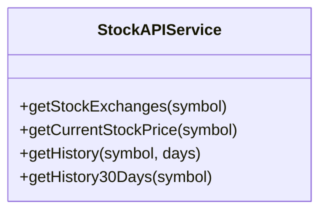
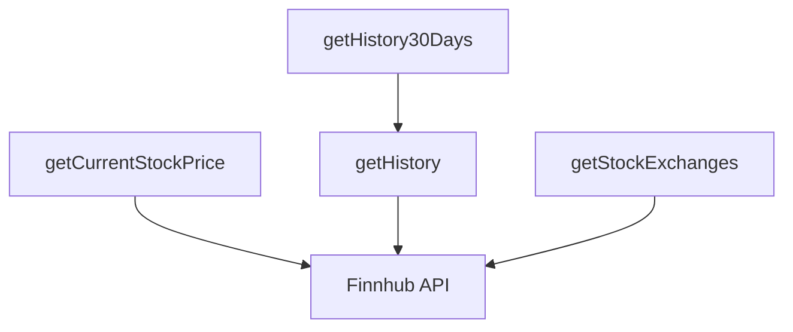
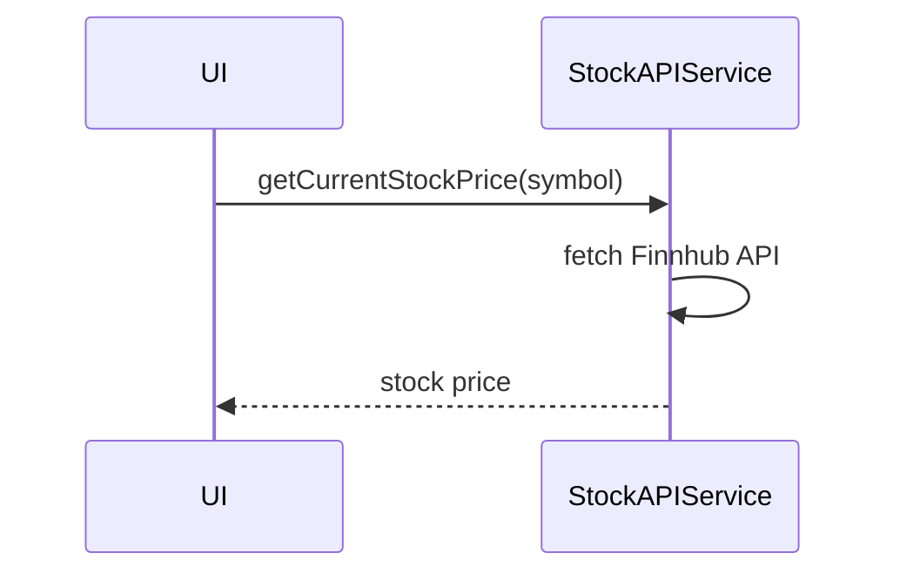

# stockAPIService

The `stockAPIService` integrates with external financial APIs (primarily Finnhub) to fetch real-time stock data, company information, and market data. It handles API authentication, currency conversion, and provides a comprehensive interface for all stock-related data needs.

# stockAPIService

The `stockAPIService` provides a simplified interface for essential stock data operations. It integrates with external financial APIs (primarily Finnhub) to fetch real-time stock prices, exchange information, and historical data with automatic currency conversion.

## Purpose
- Fetches possible stock exchange assignments (suffixes) for symbols
- Retrieves current stock prices with automatic USD to EUR conversion
- Provides historical stock data with open, midday, and close prices
- Manages API key configuration and authentication
- Provides comprehensive error handling and logging for all operations

## Usage
Import and use the service in containers, Redux slices, or other modules that need stock data:

```typescript
import { createStockAPIService } from '@/service/stockAPIService';

// Create service instance
const stockAPI = createStockAPIService();

// Get possible exchange suffixes for a symbol
const exchanges = await stockAPI.getStockExchanges('AAPL');

// Get current stock price
const price = await stockAPI.getCurrentStockPrice('AAPL.US');

// Get historical data for specified days
const history = await stockAPI.getHistory('AAPL.US', 30);

// Get 30 days of historical data (convenience method)
const history30 = await stockAPI.getHistory30Days('AAPL.US');
```

## Structure
- **Singleton Pattern**: Uses factory pattern for single instance management
- **API Integration**: Connects to Finnhub API for real-time financial data
- **Currency Support**: Automatic USD to EUR conversion based on user settings
- **Error Handling**: Comprehensive error handling with detailed logging
- **Type Safety**: Full TypeScript interfaces for all API responses
- **Utility Functions**: API key management, symbol formatting, currency conversion

## Key Methods
- `getStockExchanges(symbol)` - Get possible exchange assignments (suffixes) for a symbol
- `getCurrentStockPrice(symbol)` - Get current stock price with change information
- `getHistory(symbol, days)` - Get historical data for specified number of days
- `getHistory30Days(symbol)` - Get 30 days of historical data (convenience method)

## Example UML Class Diagram


## Example Method Dependency Diagram


## Example Sequence Diagram (Internal Flow)


---

The `stockAPIService` provides a simplified, focused interface for essential stock data operations, enabling real-time financial insights in the application.
