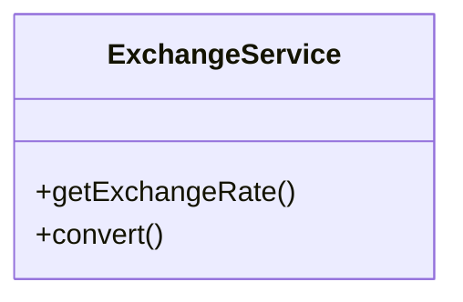
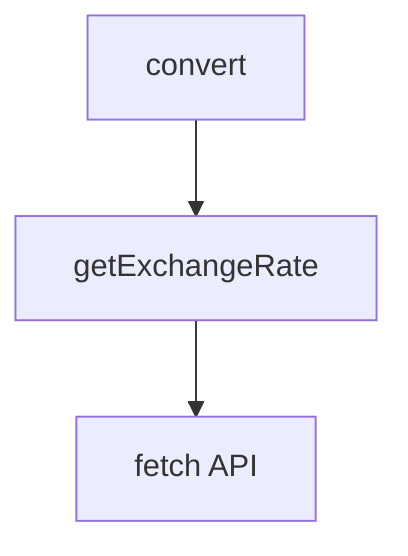
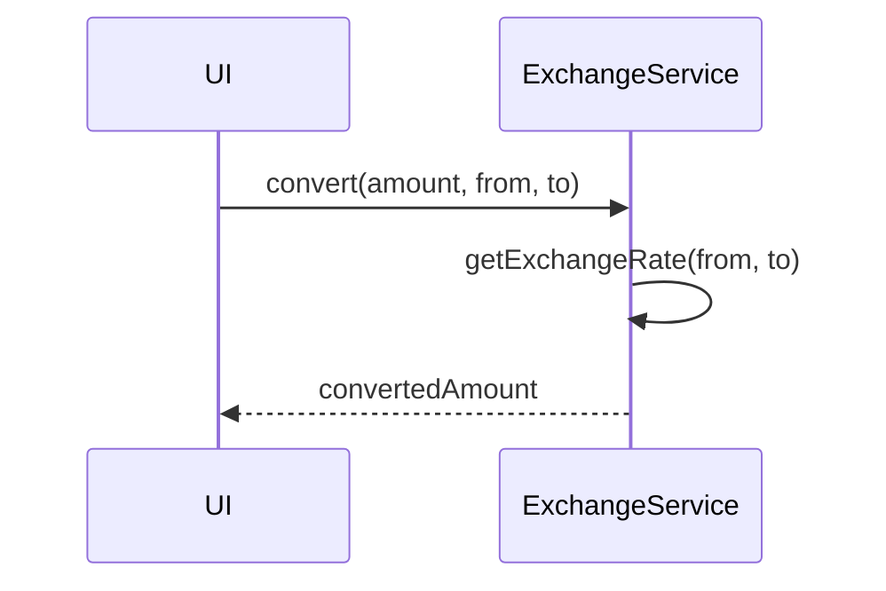

# exchangeService

The `exchangeService` manages USD to EUR exchange rate data by fetching rates from the European Central Bank (ECB) and storing them locally. It provides current and historical exchange rates for currency conversion throughout the application.

## Purpose
- Fetches daily USD/EUR exchange rates from ECB XML API
- Stores exchange rates locally in SQLite database for offline access
- Provides current exchange rates with automatic refresh capability
- Supports historical exchange rate lookups by date
- Enables currency conversion for stock prices and financial calculations
- Handles rate caching to avoid unnecessary API calls

## Usage
Import and use the service in modules that need currency conversion:

```typescript
import exchangeService from '@/service/exchangeService';

// Get today's exchange rate (auto-refreshes if needed)
const currentRate = await exchangeService.getExchangeRate();

// Get exchange rate for specific date
const historicalRate = await exchangeService.getExchangeRate('2024-01-15');

// Manually refresh today's rate
await exchangeService.refreshExchangeRate();

// Clear all exchange rate data
await exchangeService.clearExchangeRates();
```

## Structure
- **ECB Integration**: Fetches official EUR/USD rates from European Central Bank XML API
- **Local Storage**: Uses SQLite database for persistent storage and offline access
- **Smart Caching**: Only fetches new rates when today's rate is missing
- **Date-based Queries**: Supports lookups by specific date strings (YYYY-MM-DD)
- **Error Handling**: Comprehensive error handling with detailed logging
- **Singleton Pattern**: Single instance for consistent state management

## Example UML Class Diagram


## Example Method Dependency Diagram


## Example Sequence Diagram (Internal Flow)


---

The `exchangeService` enables seamless multi-currency support and accurate conversions for all financial calculations.
