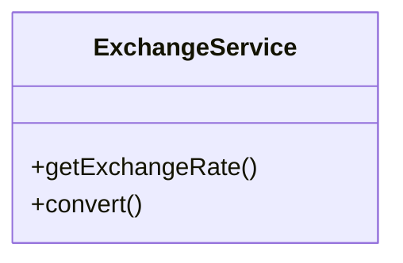
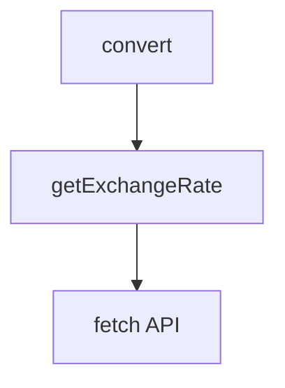
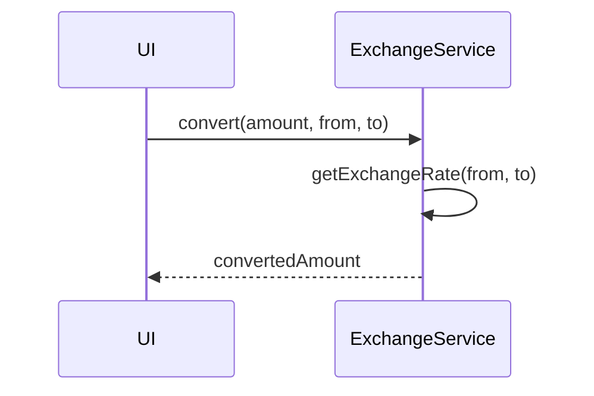

# exchangeService

The `exchangeService` handles currency exchange rates and conversions. It fetches up-to-date rates from external APIs and provides conversion utilities for use throughout the application.

## Purpose
- Fetches and caches currency exchange rates.
- Converts amounts between supported currencies.
- Supports multi-currency financial planning and reporting.

## Usage
Import and use the service in calculation modules, containers, or UI components:

```typescript
import exchangeService from '../service/exchangeService';
const rate = await exchangeService.getExchangeRate('USD', 'EUR');
const converted = exchangeService.convert(100, 'USD', 'EUR');
```

## Structure
- Provides methods for fetching and converting exchange rates.
- Integrates with external APIs for real-time data.
- Stateless and reusable.

## Example UML Class Diagram


## Example Method Dependency Diagram


## Example Sequence Diagram (Internal Flow)


---

The `exchangeService` enables seamless multi-currency support and accurate conversions for all financial calculations.
