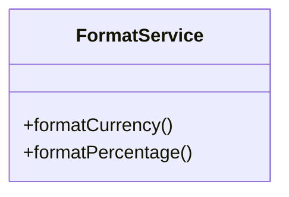
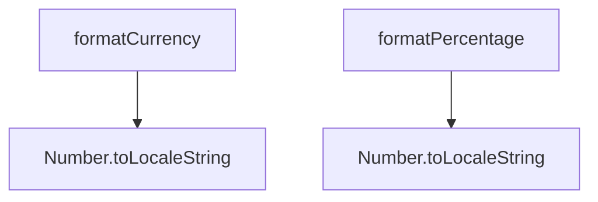
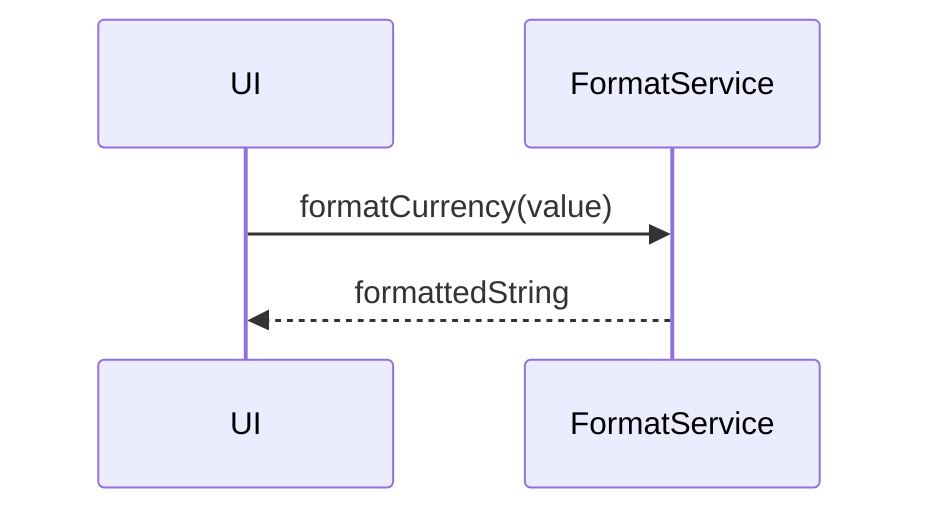

# formatService

The `formatService` provides utility functions for formatting currencies, percentages, and other financial values in a locale-aware and consistent way. It is used throughout the application to ensure all numbers are displayed in a user-friendly format.

## Purpose
- Centralizes formatting logic for currencies, percentages, and numbers.
- Ensures consistent display of financial data across the app.
- Supports localization and custom formatting rules.

## Usage
Import and use the service in UI components, containers, or other services:

```typescript
import formatService from '../service/formatService';
const formatted = formatService.formatCurrency(1234.56);
const percent = formatService.formatPercentage(0.123);
```

## Structure
- Exposes functions for currency and percentage formatting.
- Can be extended for additional formatting needs.
- Stateless and reusable.

## Example UML Class Diagram


## Example Method Dependency Diagram


## Example Sequence Diagram (Internal Flow)


---

The `formatService` ensures that all financial values are presented clearly and consistently to the user.
