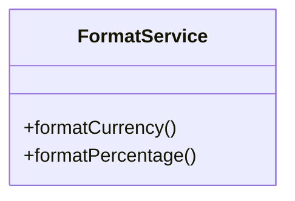
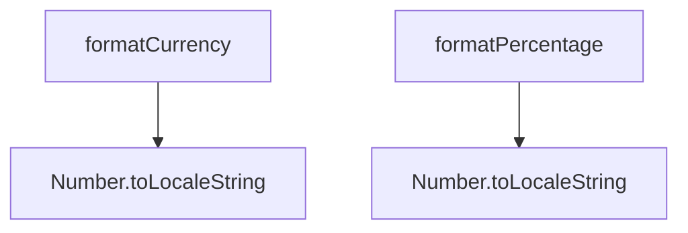
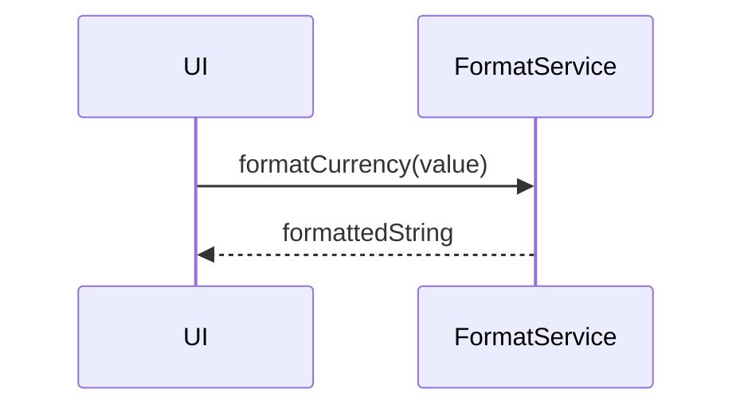

# formatService

The `formatService` provides consistent formatting functions for displaying financial data, dates, and numbers throughout the application. It centralizes all formatting logic to ensure uniform presentation and localization support.

## Purpose
- Formats currency amounts with proper symbols and decimal places
- Handles percentage formatting with customizable precision
- Provides number formatting with locale-specific separators
- Formats dates in consistent, readable formats
- Converts month numbers to localized month names
- Ensures consistent display formatting across all UI components

## Usage
Import and use the service in UI components, containers, or anywhere data needs formatting:

```typescript
import formatService from '@/service/formatService';

// Currency formatting
const formatted = formatService.formatCurrency(1234.56); // "€1,234.56"

// Percentage formatting
const percent = formatService.formatPercentage(0.1234); // "12.34%"
const customPercent = formatService.formatPercentage(0.1234, { 
  minimumFractionDigits: 1, 
  maximumFractionDigits: 1 
}); // "12.3%"

// Number formatting
const number = formatService.formatNumber(1234.567); // "1,234.567"

// Date formatting
const date = formatService.formatDate(new Date()); // "06/05/2025"

// Month formatting
const shortMonth = formatService.formatMonth(6); // "Jun"
const longMonth = formatService.formatMonth(6, 'long'); // "June"
```

## Structure
- **Currency Formatting**: Handles Euro currency with proper symbols and separators
- **Percentage Formatting**: Converts decimals to percentages with customizable precision
- **Number Formatting**: Applies locale-specific thousand separators and decimal handling
- **Date Formatting**: Consistent date display across the application
- **Month Formatting**: Converts numeric months to readable names (short/long formats)
- **Options Support**: Customizable formatting options for precision and display preferences

## Key Methods
- `formatCurrency(amount)` - Format numbers as currency with Euro symbol
- `formatPercentage(value, options?)` - Convert decimal to percentage with customizable precision
- `formatNumber(value, options?)` - Format numbers with thousand separators and decimal precision
- `formatDate(date)` - Format Date objects or date strings consistently
- `formatMonth(monthNumber, format?)` - Convert month number (1-12) to month name

## Example UML Class Diagram


## Example Method Dependency Diagram


## Example Sequence Diagram (Internal Flow)


---

The `formatService` ensures that all financial values are presented clearly and consistently to the user.
