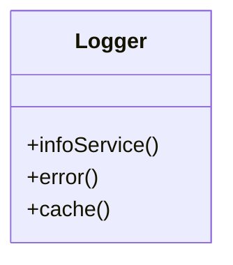
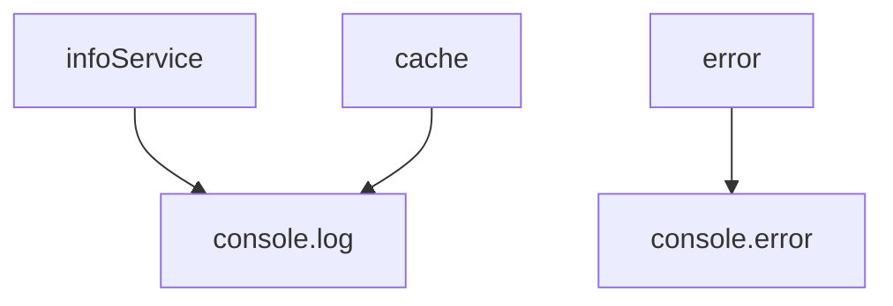
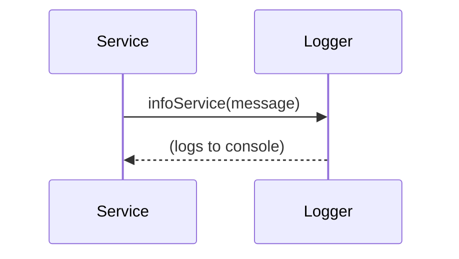

# Logger

The `Logger` service provides a comprehensive logging system with multiple log levels, feature flag controls, and persistent storage capabilities. It supports both development debugging and production monitoring with platform-aware formatting and file export functionality.

## Purpose
- Provides structured logging with multiple severity levels (info, warn, error, cache, service)
- Supports feature flag-controlled logging for granular control
- Offers persistent log storage in localStorage with automatic size management
- Includes caller function detection for better debugging context
- Supports log export functionality for debugging and support
- Provides platform-aware formatting (mobile vs desktop)
- Integrates Redux-specific logging for state management debugging

## Usage
Import and use the Logger throughout the application for debugging and monitoring:

```typescript
import Logger from '@/service/Logger/logger';

// Basic logging
Logger.log('Basic log message');

// Specific log levels
Logger.info('Information message');
Logger.warn('Warning message');
Logger.error('Error occurred');

// Service-specific logging
Logger.infoService('API call completed');

// Cache-specific logging
Logger.cache('Cache hit for asset calculation');

// Redux-specific logging
Logger.infoRedux('Action dispatched: SET_ASSETS');

// Log management
Logger.deleteLogs(); // Clear all stored logs
Logger.exportLogs(); // Export logs to file
```

## Structure
- **Feature Flag Control**: Each log level can be enabled/disabled via feature flags
- **Persistent Storage**: Logs stored in localStorage with automatic rotation (max 1000 entries)
- **Caller Detection**: Automatically detects and includes calling function name
- **Platform Awareness**: Different formatting for mobile vs desktop platforms
- **Export Functionality**: Can export logs to file for debugging purposes
- **Multiple Log Levels**: Supports info, warning, error, cache, service, and Redux logging

## Example UML Class Diagram


## Example Method Dependency Diagram


## Example Sequence Diagram (Internal Flow)


---

The `Logger` service is essential for monitoring, debugging, and maintaining the health of the application.
