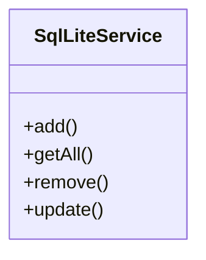
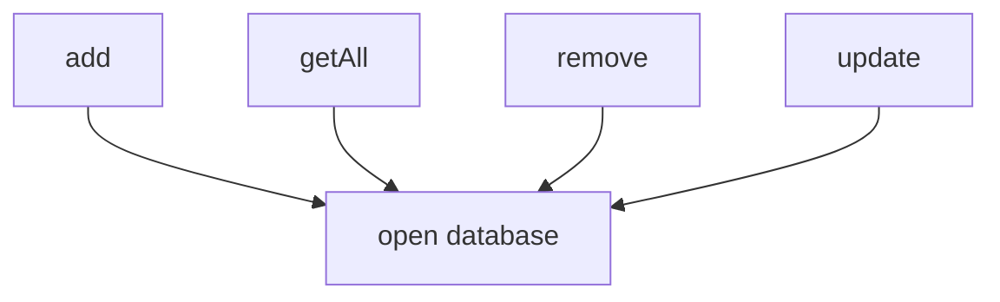
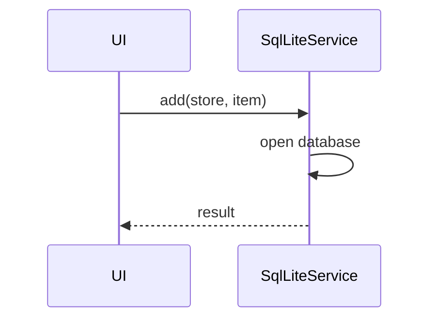

# sqlLiteService

The `sqlLiteService` provides local data persistence using IndexedDB through the `idb` library. It enables offline storage and retrieval of financial data, supporting CRUD operations, data import/export, and database versioning for all application entities.

## Purpose
- Stores and retrieves financial data (assets, incomes, expenses, liabilities, exchange rates) locally
- Supports offline-first usage with full CRUD operations
- Handles database initialization, schema creation, and migrations
- Provides data import/export functionality for backup and restore
- Manages database versioning for schema evolution
- Abstracts IndexedDB complexity with a simple, type-safe interface

## Usage
Import and use the service in containers, Redux slices, or other modules that need data persistence:

```typescript
import sqlLiteService from '../service/sqlLiteService';

// Create operations
const assetId = await sqlLiteService.add('assets', newAsset);
const liabilityId = await sqlLiteService.add('liabilities', newLiability);

// Read operations
const allAssets = await sqlLiteService.getAll('assets');
const specificAsset = await sqlLiteService.getById('assets', 'asset-id');

// Update operations
await sqlLiteService.update('assets', updatedAsset);

// Delete operations
await sqlLiteService.remove('assets', 'asset-id');

// Import/Export operations
const backupData = await sqlLiteService.exportData();
await sqlLiteService.importData(jsonBackupString);
```

## Structure
- **Database Schema**: Supports 5 object stores (assets, liabilities, expenses, income, exchangeRates)
- **Type Safety**: Full TypeScript interfaces for all database operations
- **CRUD Operations**: Complete Create, Read, Update, Delete functionality
- **Import/Export**: JSON-based backup and restore capabilities
- **Database Versioning**: Handles schema migrations (currently version 2)
- **Index Support**: Optimized queries with indexes on key fields

## Supported Data Stores
- `assets` - Financial assets (stocks, bonds, real estate, cash)
- `liabilities` - Debts and obligations
- `expenses` - Regular and one-time expenses
- `income` - Income sources and amounts
- `exchangeRates` - Historical USD/EUR exchange rate data

## Key Methods
- `getAll<T>(storeName)` - Get all records from a store
- `getById<T>(storeName, id)` - Get specific record by ID
- `add<T>(storeName, item)` - Add new record, returns generated ID
- `update<T>(storeName, item)` - Update existing record
- `remove(storeName, id)` - Delete record by ID
- `exportData()` - Export all data as JSON string
- `importData(jsonData)` - Import data from JSON backup

## Database Schema
```typescript
interface FinanceDB extends DBSchema {
  assets: { key: string; value: Asset; indexes: { 'by-type': string } };
  liabilities: { key: string; value: Liability };
  expenses: { key: string; value: Expense; indexes: { 'by-category': string } };
  income: { key: string; value: Income };
  exchangeRates: { key: string; value: ExchangeRate; indexes: { 'by-date': string } };
}
```

## Data Import/Export
The service supports complete data backup and restore:
- Export creates JSON with all data and timestamp
- Import validates data structure before importing
- Supports migration between different app versions
- Maintains data integrity during import operations

## Example UML Class Diagram


## Example Method Dependency Diagram


## Example Sequence Diagram (Internal Flow)


---

The `sqlLiteService` is the foundation for local data storage, enabling offline capabilities and fast access to all user data.
