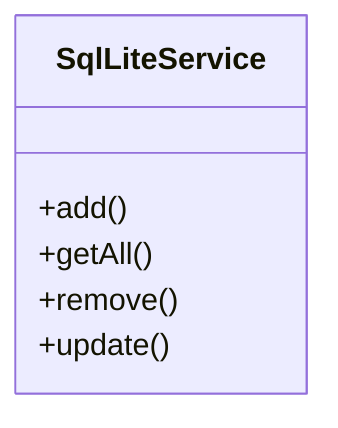
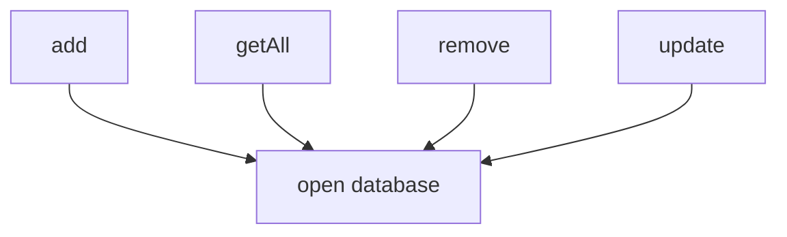
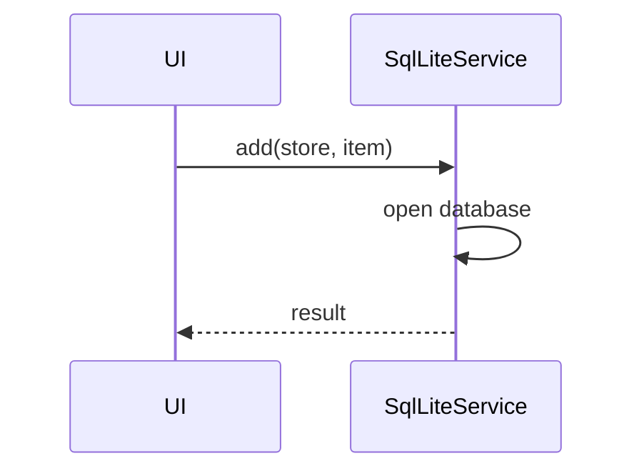

# sqlLiteService

The `sqlLiteService` provides local data persistence using SQLite. It enables offline storage and retrieval of financial data, supporting robust and fast access to user data across the application.

## Purpose
- Stores and retrieves financial data (assets, incomes, expenses, etc.) locally.
- Supports offline-first usage and fast data access.
- Abstracts database operations for easy integration.

## Usage
Import and use the service in containers, Redux slices, or helper modules:

```typescript
import sqlLiteService from '../service/sqlLiteService';
await sqlLiteService.add('assets', asset);
const allAssets = await sqlLiteService.getAll('assets');
```

## Structure
- Provides CRUD methods for all major data types.
- Handles database initialization and migrations.
- Stateless and reusable.

## Example UML Class Diagram


## Example Method Dependency Diagram


## Example Sequence Diagram (Internal Flow)


---

The `sqlLiteService` is the foundation for local data storage, enabling offline capabilities and fast access to all user data.
