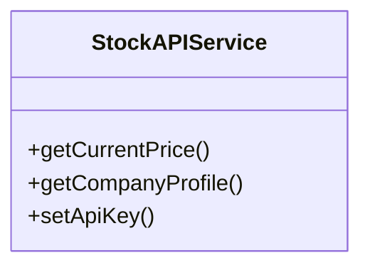
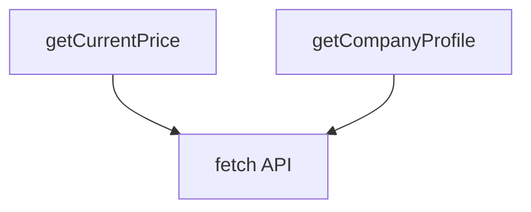
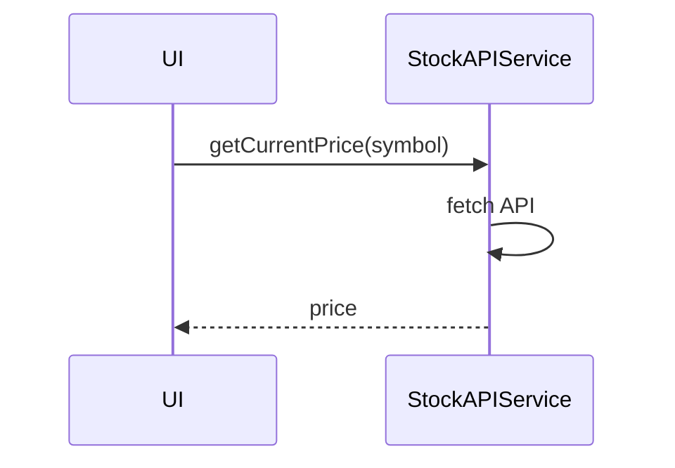

# stockAPIService

The `stockAPIService` integrates with external financial APIs (primarily Finnhub) to fetch real-time stock data, company information, and market data. It handles API authentication, currency conversion, and provides a comprehensive interface for all stock-related data needs.

## Purpose
- Fetches real-time stock quotes and batch quotes for multiple symbols
- Retrieves historical stock data with customizable time ranges and intervals
- Provides company profile information including industry, sector, and description
- Fetches financial metrics like P/E ratio, dividend yield, and other key indicators
- Handles stock search functionality for finding symbols by name or ticker
- Supports currency conversion between USD and EUR via exchange service
- Manages API key configuration and authentication
- Provides error handling and logging for all API operations

## Usage
Import and use the service in containers, Redux slices, or other modules that need market data:

```typescript
import { createStockAPIService } from '../service/stockAPIService';

// Create service instance
const stockAPI = createStockAPIService();

// Get real-time stock quote
const quote = await stockAPI.getQuote('AAPL');

// Get multiple quotes at once
const quotes = await stockAPI.getQuotes(['AAPL', 'MSFT', 'GOOGL']);

// Search for stocks
const searchResults = await stockAPI.searchStocks('Apple');

// Get company information
const profile = await stockAPI.getCompanyProfile('AAPL');

// Get historical data
const historical = await stockAPI.getHistoricalData('AAPL', '1Y', '1D');
```

## Structure
- **Singleton Pattern**: Uses factory pattern for single instance management
- **API Integration**: Connects to Finnhub API for real-time financial data
- **Currency Support**: Automatic USD to EUR conversion based on user settings
- **Error Handling**: Comprehensive error handling with detailed logging
- **Type Safety**: Full TypeScript interfaces for all API responses
- **Utility Functions**: API key management, symbol formatting, currency conversion

## Key Methods
- `getQuote(symbol)` - Get real-time quote for a single stock
- `getQuotes(symbols)` - Get quotes for multiple stocks in batch
- `searchStocks(query)` - Search for stocks by name or symbol
- `getCompanyProfile(symbol)` - Get company information and profile
- `getHistoricalData(symbol, range, interval)` - Get historical price data
- `getFinancialMetrics(symbol)` - Get financial ratios and metrics
- `getStockEvents(symbol)` - Get upcoming events like earnings, dividends
- `getOptionsData(symbol)` - Get options chain data
- `getStockNews(symbol)` - Get latest news for a stock

## Example UML Class Diagram


## Example Method Dependency Diagram


## Example Sequence Diagram (Internal Flow)


---

The `stockAPIService` is the gateway for all external stock data, enabling real-time financial insights in the application.
