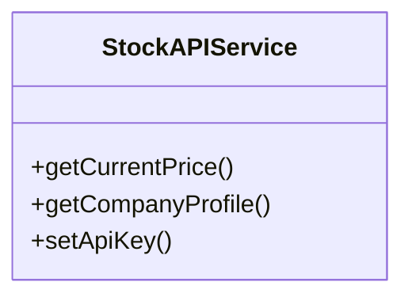
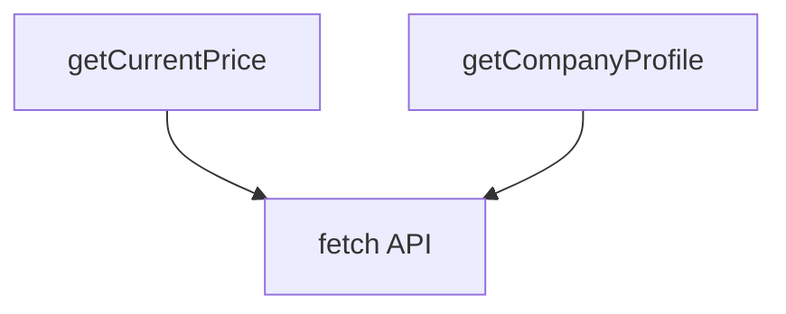
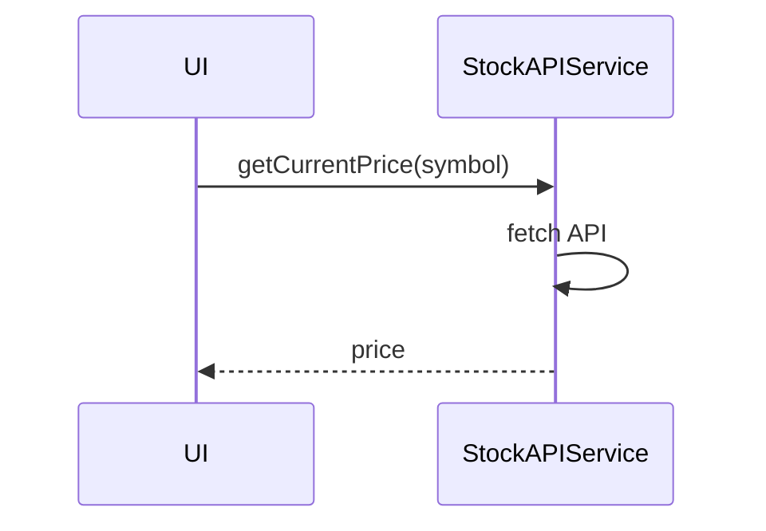

# stockAPIService

The `stockAPIService` integrates external stock APIs (such as Finnhub) to fetch real-time stock data, prices, and company information. It is used by containers and services that require up-to-date market data.

## Purpose
- Fetches real-time stock prices and company data from external APIs.
- Supports financial calculations and dashboards with live data.
- Handles API key management and error handling.

## Usage
Import and use the service in containers, Redux slices, or calculation modules:

```typescript
import stockAPIService from '../service/stockAPIService';
const price = await stockAPIService.getCurrentPrice('AAPL');
const company = await stockAPIService.getCompanyProfile('AAPL');
```

## Structure
- Provides methods for fetching stock prices and company info.
- Handles API authentication and error management.
- Stateless and reusable.

## Example UML Class Diagram


## Example Method Dependency Diagram


## Example Sequence Diagram (Internal Flow)


---

The `stockAPIService` is the gateway for all external stock data, enabling real-time financial insights in the application.
